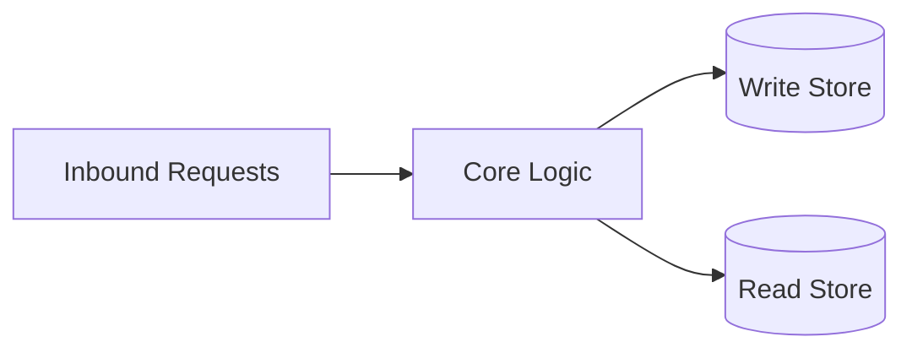
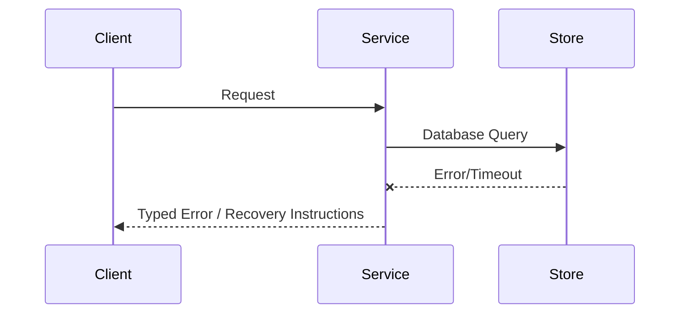

# Architecture

## Direction
cli

## What This Project Is
builddeck is a Go CLI/TUI for read-only Buildkite operations visibility.
A typed internal Buildkite API client feeds a Bubble Tea/Lip Gloss terminal interface with organizations, pipelines, builds, jobs, annotations, artifacts, queues, agents, logs, and health-oriented status views.

Architectural principles:
- **Simplicity**: Keep components focused and reusable.
- **Modularity**: Clearly defined interface boundaries and dependency separation.
- **Reliability**: Graceful failure handling and thorough verification.

## Current Facts
- Runtime/languages: Go
- Detected surfaces/framework hints: Go CLI, Bubble Tea TUI
- Product type: cli

## Architecture Map
This project's architecture consists of the following key layers/directories:
- `cmd/builddeck/`: CLI entrypoint.
- `internal/buildkite/`: typed Buildkite API client and data models.
- `internal/tui/`: Bubble Tea model, update loop, views, filtering, and key handling.
- `README.md`: operator-facing installation, token, scope, and keybinding documentation.

## Data Flows
- `cmd/builddeck` starts the TUI and reads configuration from the environment.
- `internal/buildkite` authenticates with `BUILDKITE_API_TOKEN` and loads read-only Buildkite API data.
- `internal/tui` stores the loaded snapshot in the Bubble Tea model, renders panes, handles selection/search/navigation, and refreshes without blocking the UI.

## Strongest Existing Primitives
- Typed Buildkite client boundaries keep external API behavior separate from TUI state.
- Bubble Tea update/model separation keeps input handling, refresh messages, loading states, and rendering testable.
- Search/filter helpers are isolated under `internal/tui` and covered by package tests.

## Topology
```text
Terminal User -> cmd/builddeck -> TUI Model -> Buildkite Client -> Buildkite API
```

## Store Boundaries


## Happy Path Sequence
```text
Client request -> API validation -> domain execution -> persistence -> response with trace id
```

## Error Path


## Execution Path
- Ingress parse + validation:
- Policy/interlock checks:
- Core execution + persistence:
- Verification and artifact emission:

## Concurrency and Runtime Model
- Execution model:
- Isolation boundaries:
- Backpressure strategy:
- Shared state synchronization:

## Deployment Topology
- Runtime units:
- Region/zone model:
- Rollout strategy (blue/green/canary):
- Rollback trigger and blast-radius scope:

## Data and Contracts
- Inbound contracts (CLI/API/events):
- Outbound dependencies (datastores/queues/external APIs):
- Data ownership boundaries:
- Schema evolution + migration policy:

## ADR Register
| ADR | Title | Status | Rationale | Date |
|---|---|---|---|---|
| ADR-001 | Initial topology choice | Proposed | Define first stable architecture | YYYY-MM-DD |

## Delivery Plan (first 3 slices)
- Slice 1 (ship first):
- Slice 2:
- Slice 3:

## Risks and Mitigations
| Risk | Likelihood | Impact | Mitigation |
|---|---|---|---|
| Contract drift across components | Medium | High | Spec + schema checks in CI |
| Runtime saturation under peak load | Medium | High | Capacity model + load tests |
