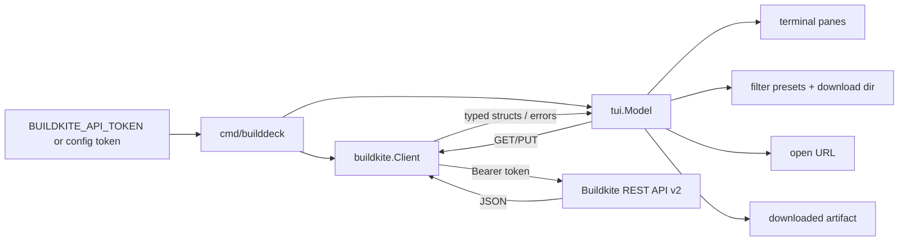
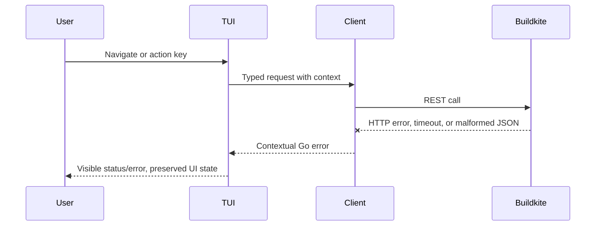

# Architecture

## Direction
Local Go CLI with a Bubble Tea terminal UI and a typed Buildkite REST API client.

## What This Project Is
`builddeck` is a local terminal application, not a hosted service. It turns a user's Buildkite token into a keyboard-driven, live-updating view over Buildkite organizations, pipelines, builds, jobs, logs, annotations, artifacts, and agents.

## Current Facts
- Runtime/language: Go.
- TUI framework: Bubble Tea with Lip Gloss styling.
- External dependency: Buildkite REST API v2.
- Local persistence: user config and optional downloaded artifacts.
- No daemon, server, queue, webhook consumer, or repository-owned application database.

## Runtime Topology
## Topology
```text
terminal
  -> cmd/builddeck/main.go
     -> internal/config.Load
     -> internal/buildkite.Client
     -> internal/tui.Model
        -> Buildkite REST API v2
        -> local config file
        -> optional browser process
        -> optional artifact download path
```

## Key Layers
## Architecture Map
- `cmd/builddeck`: executable entrypoint, token selection, fatal startup errors, Bubble Tea program launch.
- `internal/buildkite`: typed REST client, Buildkite JSON models, pagination, error formatting, action endpoints, artifact redirect resolution.
- `internal/tui`: Bubble Tea model, update loop, views, styles, summaries, filters, global search, keybindings, action targeting, log pane, agent view, options/preset flows.
- `internal/config`: XDG/default config path, minimal TOML parser/writer, filter presets, download directory, token override behavior.
- `README.md`: human-facing install/run/keymap/current-scope contract.
- `.decapod/generated/specs`: governed project contracts for intent, architecture, interfaces, validation, semantics, operations, and security.

## Strongest Existing Primitives
- `buildkite.Client` centralizes authenticated HTTP requests, timeout, pagination, typed decoding, and endpoint-specific error context.
- `tui.Model` holds loaded Buildkite state, active pane, selections, filters, action/log/download state, and refresh cadence.
- `summary.BuildSummary` derives health counts and failure rate from loaded builds.
- `search.go` builds stable filtered index lists without mutating source Buildkite data.
- `config.Config` separates user-local preferences from committed project state and omits token material on save.

## Data Flow
## Data Flows

```mermaid
flowchart LR
  Token[BUILDKITE_API_TOKEN or config token] --> Main[cmd/builddeck]
  Main --> Client[buildkite.Client]
  Main --> Model[tui.Model]
  Model -->|GET/PUT| Client
  Client -->|Bearer token| API[Buildkite REST API v2]
  API -->|JSON| Client
  Client -->|typed structs / errors| Model
  Model --> View[terminal panes]
  Model --> Config[filter presets + download dir]
  Model --> Browser[open URL]
  Model --> File[downloaded artifact]
```

## Buildkite Boundary
## Store Boundaries
Buildkite is the system of record for organizations, pipelines, builds, jobs, annotations, artifacts, agents, logs, and action results. `builddeck` caches only in-memory views for the current TUI session and local user preferences in config.

## Happy Path Sequence
```text
User starts builddeck -> token is selected -> TUI starts -> Buildkite data loads -> user navigates panes -> selected data/actions render in terminal
```

## Execution Path
- Startup validates config and token availability.
- The TUI initializes with a Buildkite client and config.
- Initial and refresh commands load organizations, then pipelines, builds, details, annotations, artifacts, agents, and logs as the user navigates.
- User keypresses update pane focus, selection, filter/search state, or enqueue explicit Buildkite actions.
- Buildkite errors become user-visible status/error messages rather than panics.
- Manual refresh clears caches and preserves current selection where possible.

## Error Path

```mermaid
sequenceDiagram
  participant User
  participant TUI
  participant Client
  participant Buildkite
  User->>TUI: Navigate or action key
  TUI->>Client: Typed request with context
  Client->>Buildkite: REST call
  Buildkite--xClient: HTTP error, timeout, or malformed JSON
  Client-->>TUI: Contextual Go error
  TUI-->>User: Visible status/error, preserved UI state
```

## Data and Contracts
- Inbound contracts: CLI invocation, environment variable, local TOML config, terminal key events.
- Outbound dependencies: Buildkite REST API v2, browser opener, filesystem writes for config/downloaded artifacts.
- Data ownership boundaries: Buildkite owns CI data; the user owns local config and downloads; Decapod owns governance state.
- Schema evolution: Buildkite JSON structs evolve through `internal/buildkite/types.go` with endpoint tests.

## Concurrency and Runtime Model
- Single Bubble Tea event loop owns UI state transitions.
- Network work runs as Bubble Tea commands returning typed messages.
- HTTP requests use context-aware calls and a 30-second client timeout.
- In-flight refresh/action guards prevent duplicate concurrent requests.
- Selection sequence tracking prevents stale build-detail responses from overwriting newer selections.
- No background daemon or long-lived process remains after the TUI exits.

## Deployment Topology
- Runtime unit: one local `builddeck` process in a user terminal.
- Installation: `go install github.com/alexhraber/builddeck/cmd/builddeck@latest` or local `go build`.
- Release blast radius: user-local binary; no server migration or shared datastore.
- Rollback: install an earlier binary version or build a prior git revision.

## ADR Register
| ADR | Title | Status | Rationale | Date |
|---|---|---|---|---|
| ADR-001 | Local CLI/TUI over hosted service | Accepted | Terminal workflow, no server ops, user-local token boundary | 2026-07-08 |
| ADR-002 | Buildkite REST API v2 first | Accepted | Matches available endpoints and current implementation | 2026-07-08 |
| ADR-003 | Token priority env over config | Accepted | Preserves scriptability and reduces accidental persisted-secret reliance | 2026-07-08 |
| ADR-004 | Pane-aware action targeting | Accepted | Keeps mutations tied to visible context | 2026-07-08 |

## Delivery Plan (first 3 slices)
- Slice 1: keep current Buildkite TUI behavior, tests, README, and generated specs synchronized.
- Slice 2: improve artifact selection and loaded-data search depth without weakening token or action safety boundaries.
- Slice 3: evaluate GraphQL dashboard snapshots when REST request volume becomes a measured limitation.

## Risks and Mitigations
| Risk | Likelihood | Impact | Mitigation |
|---|---|---|---|
| Buildkite API drift | Medium | Medium | Endpoint tests, typed error messages, conservative docs |
| Token leakage | Low | High | Prefer env var, omit token on config save, do not log bearer token |
| Hidden mutation target | Medium | High | Pane-aware targeting, visible selected/top resource rules |
| API rate pressure | Medium | Medium | Adaptive polling, in-flight guards, manual refresh |
| Terminal layout clipping | Medium | Medium | Compact fallback and width-aware rendering |
