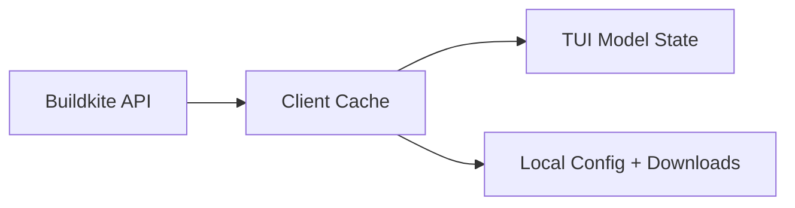
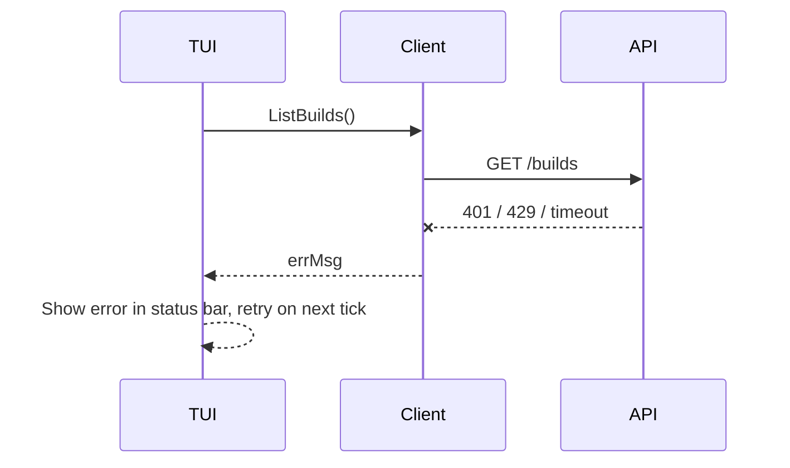

# Architecture

## Direction
Terminal UI (Go CLI with Bubble Tea)

## What This Project Is
`builddeck` is a Go CLI project that renders a Bubble Tea / Lip Gloss TUI. It reads from the Buildkite REST API and displays live build data in a three-pane layout. There is no server, no database, and no persistent state beyond a local config file.

Architectural principles:
- **Simplicity**: Each package has one responsibility. The TUI layer is separated from the API client and config.
- **Modularity**: `internal/buildkite` (API client), `internal/config` (config loading), `internal/tui` (Bubble Tea model/view/update) — clear dependency direction.
- **Reliability**: Graceful nil-pointer guards, loading/error states in every pane, in-flight request deduplication.

## Current Facts
- Runtime/languages: Go (1.26+)
- UI framework: Bubble Tea + Lip Gloss + Bubbles
- Grapheme handling: `rivo/uniseg` v0.4.7
- Buildkite API client: hand-written REST client in `internal/buildkite`
- Render layout: Three-pane with overlays (artifact picker, preset picker, help, search, options, stats, agent view, log view)
- Auth: `BUILDKITE_API_TOKEN` env var (read at startup, not a long-running session)
- Config: `~/.config/builddeck/config.toml` via `internal/config`

## Architecture Map
```
cmd/builddeck/           — CLI entrypoint (flag parsing, token check)
internal/
  buildkite/
    client.go            — REST API client (ListOrgs, ListPipelines, ListBuilds, GetBuild, ...)
    types.go             — Buildkite API type definitions
    client_test.go       — HTTP mock tests (15 tests)
  config/
    config.go            — Config file loading and merging with env
    config_test.go       — Config tests
  tui/
    model.go             — Bubble Tea Model struct + Msg types
    update.go            — update() — all commands, key handling, API calls (~1950 lines)
    views.go             — view() — all rendering (panes, overlays, status bar) (~1370 lines)
    styles.go            — 6 Lip Gloss themes (Tokyo Night, Dracula, Gruvbox Dark, Nord, Monokai, Cyberpunk)
    keys.go              — Key binding definitions
    search.go            — Pane filtering + global search logic
    summary.go           — Build health summary statistics
    timefmt.go           — Time / duration formatting
    emoji.go             — Nerd Font PUA glyphs (200+) + Unicode emoji bank with sync.RWMutex
    emoji-unicode.json   — Embedded Unicode emoji map (1902 entries from Buildkite webapp)
    source_refs.go       — Log-to-source-code reference parsing (file:line extraction)
    model_test.go        — TUI model state tests
    search_test.go       — Filter/search tests
    summary_test.go      — Summary statistics tests
    timefmt_test.go      — Time formatting tests
    emoji_test.go        — Emoji bank tests (17 tests)
    source_refs_test.go  — Source reference parsing tests
```

## Data Flows
1. **Startup**: `main()` loads config, creates API client, initializes Bubble Tea program.
2. **Org load**: On init, `fetchOrgsCmd` calls `client.ListOrganizations()`, dispatches `orgsLoadedMsg`.
3. **Pipeline load**: On org select, `client.ListPipelines()` fetches pipelines for that org.
4. **Build load**: On pipeline select, `client.ListBuilds()` fetches recent 25 builds.
5. **Build detail**: On build select, fetches jobs, annotations, artifacts, tag, and emoji in parallel.
6. **Logs**: `client.GetStepLog()` fetches individual job log with content query param + raw text fallback.
7. **Polling**: `tickMsg` fires every 2s (active) or 10s (idle), re-fetching builds and detail.
8. **Checksums**: `loadArtifactChecksums()` downloads `.sha256` artifacts and parses the hash.
9. **Agents**: `ListAgents()` fetches all org agents on `a` keypress with queue saturation view.
10. **Source refs**: Log content parsed for `file:line` and `file:line:col` patterns on load.

## Strongest Existing Primitives
- **`internal/buildkite.Client`**: Typed REST client with configurable base URL, automatic pagination (Link header), structured error handling, and generics-based JSON decoding.
- **`internal/tui.Model`**: Central state tree with nil-safe accessors (`selectedOrg()`, `selectedPipeline()`, etc.), in-flight request guards, 250ms build selection debounce, and cache maps for build details/annotations/artifacts/step logs.
- **`internal/tui/renderEmoji()`**: Grapheme-aware emoji renderer supporting Nerd Font PUA glyphs + 1902 Unicode emoji entries + live Buildkite API custom emoji, with `sync.RWMutex` thread safety.
- **`internal/tui/source_refs.go`**: Parses ANSI-stripped log content for file:line references, deduplicates, and enables keyboard navigation (n/N) to each source location.
- **`internal/tui/search.go`**: Case-insensitive normalized substring search across pipelines (name/slug/repo/URL), builds (number/state/branch/commit/message/creator/URL), and steps (state/name/label/command/agent query), plus global search across all entities capped at 50 results.

## Topology
```text
User Terminal
  ↕ Bubble Tea event loop (model/update/view)
  ↕ internal/tui (all rendering + key handling)
  ↕ internal/buildkite (REST client)
  ↕ Buildkite API (api.buildkite.com)
    ↕ filesystem (~/.config/builddeck/config.toml, artifact downloads)
```

## Store Boundaries

```mermaid
flowchart LR
  BK[Buildkite API] --> C[Client Cache]
  C --> M[TUI Model State]
  C --> FS[Local Config + Downloads]
```

No write store — all state is cached in-memory in the Bubble Tea Model.

## Happy Path Sequence
```text
User runs builddeck
  → Token present → load config
  → Fetch orgs → render left pane
  → Select org → fetch pipelines
  → Select pipeline → fetch builds
  → Select build → fetch jobs, annotations, artifacts, tags (incl .sha256)
  → d → artifact picker overlay → enter → download selected artifact
  → L → log pane → view real-time log output, navigate source refs with n/N
  → a → agent saturation view → per-queue utilization breakdown
  → ctrl+f → global search across all loaded data
  → q → quit
```

## Error Path

```mermaid
sequenceDiagram
  participant TUI
  participant Client
  participant API
  TUI->>Client: ListBuilds()
  Client->>API: GET /builds
  API--xClient: 401 / 429 / timeout
  Client-->>TUI: errMsg
  TUI-->>TUI: Show error in status bar, retry on next tick
```

All API errors are non-fatal. The TUI shows the error in the status bar and retries on the next polling cycle.

## Execution Path
- Ingress: CLI arg parsing (`--version`) → env var token check → config load
- Core: Bubble Tea event loop — `Init()` fetches orgs, `Update()` handles messages + keys, `View()` renders panes
- Data: API responses deserialized directly into typed structs, cached in model, filtered in-place
- Verification: `t.Log()` output captured during testing, CI gates via Buildkite pipeline

## Concurrency and Runtime Model
- Execution model: Single-threaded Bubble Tea event loop (goroutine-safe via `tea.Cmd`)
- Isolation boundaries: All API calls are `tea.Cmd` functions that run in goroutines, results dispatched as `tea.Msg`
- Backpressure strategy: `isFetching` / `inFlight` guards prevent concurrent duplicate requests per scope (builds, detail, annotations, artifacts)
- Shared state synchronization: Bubble Tea guarantees serial access to `Model.Update()`

## Deployment Topology
- Runtime units: Single binary (`builddeck`) — no deployment needed
- Distribution: GitHub releases via `gh release create/upload`; version injected via `-ldflags`
- Installation: `go install` or download binary from releases page
- Rollback: Reinstall previous version

## Data and Contracts
- Inbound contracts: `BUILDKITE_API_TOKEN` env var, `~/.config/builddeck/config.toml`
- Outbound dependencies: Buildkite REST API at `https://api.buildkite.com`
- Data ownership boundaries: All user data owned by Buildkite; builddeck only reads/caches
- Schema evolution: Buildkite types evolve upstream — client handles gracefully via `json:"-"` skip fields

## ADR Register
| ADR | Title | Status | Rationale | Date |
|---|---|---|---|---|
| ADR-001 | Bubble Tea for TUI | Accepted | Mature Go TUI framework with Lip Gloss styling | 2026-01 |
| ADR-002 | REST API only | Accepted | Simpler than GraphQL, sufficient for MVP scope | 2026-01 |
| ADR-003 | Nerd Font icons | Accepted | Rich visual language for build states and languages | 2026-03 |
| ADR-004 | SHA256 from .sha256 artifacts | Accepted | Real content hash matching pipeline checksum | 2026-07 |
| ADR-005 | Embedded Unicode emoji bank | Accepted | 1902 entries from Buildkite webapp — no external API call needed | 2026-07 |
| ADR-006 | Log-to-source reference parsing | Accepted | Navigate file:line refs in logs with n/N keys | 2026-07 |
| ADR-007 | 6 Lip Gloss themes | Accepted | Tokyo Night, Dracula, Gruvbox Dark, Nord, Monokai, Cyberpunk | 2026-07 |

## Delivery Plan (first 3 slices)
- Slice 1 (MVP): Org/pipeline/build browsing, log viewing, basic polling
- Slice 2: Artifact download picker, SHA256 checksums, global search
- Slice 3: Filter presets, agent saturation view, help overlay, source refs

## Risks and Mitigations
| Risk | Likelihood | Impact | Mitigation |
|---|---|---|---|
| Buildkite API rate limiting | Medium | Medium | Adaptive polling (2s/10s), in-flight guards |
| Nerd Font missing | Low | Medium | Unicode fallback, tests for render width |
| API schema changes | Low | High | Parse leniently, test with live data |
| Terminal size too small | Medium | Low | Graceful degradation, minimum size check |
| Emoji glyph width mismatch | Low | Medium | `uniseg.Graphemes()` for accurate grapheme cluster measurement |
