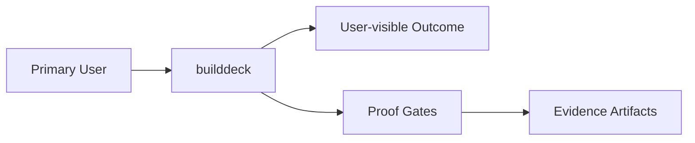

# Intent

## Product Outcome
- The foundation for builddeck, a production-quality Buildkite terminal flight deck: a sleek, live-updating Go TUI that gives platform engineers and release captains a dense, navigable control surface for organizations, pipelines, builds, jobs, queues, agents, logs, annotations, artifacts, and build health, starting with safe read-only visibility into real Buildkite API data and a clean internal architecture that can later support operational actions like retry, rebuild, unblock, cancel, log tailing, artifact download, browser handoff, bottleneck diagnosis, queue/agent saturation views, and incident-command workflows; b7k may be used as a short moniker, but the product, repository, documentation, and command identity should consistently present as builddeck.

## What This Project Is
Decapod is a daemonless, local-first governance kernel for AI coding agents. It is not a passive checklist or a documentation folder. Agents invoke Decapod at governance boundaries to turn human intent into explicit local contracts, refresh generated context, enforce workspace and policy boundaries, coordinate mutable work, and require proof-backed completion.

Key operating facts:
- **Agent control plane**: Agents call Decapod before inference-heavy work, before workspace mutation, before validation, and before claiming completion.
- **Repo-native state**: Canonical mutable state lives under `.decapod/`, including todos, generated specs, context capsules, proof artifacts, policy, and isolated workspaces.
- **Constitution-driven context**: The embedded constitution and project overrides provide queryable doctrine for architecture, interfaces, security, testing, delivery, and agent behavior.
- **Generated specs as live contracts**: `.decapod/generated/specs/*.md` are generated from repo context and refreshed by Decapod execution so agents receive current architecture, interface, validation, operational, and security context.
- **Todo-based coordination**: `decapod todo` provides claim ownership, dependencies, and event journaling for concurrent agents.
- **Validation and proof**: `decapod validate`, proof plans, health claims, and provenance artifacts form the promotion boundary.
- **Workspace isolation**: Todo-scoped git worktrees and optional containers keep agent changes out of the human root checkout.

## Product View

## Inferred Baseline
- Repository: builddeck
- Product type: not classified yet
- Primary languages: Go
- Detected surfaces: not detected yet

## Scope
| Area | In Scope | Proof Surface |
|---|---|---|
| Core workflow | Define a concrete user-visible workflow | Acceptance criteria + tests |
| Data contracts | Document canonical inputs/outputs | [INTERFACES.md](./INTERFACES.md) and schema checks |
| Delivery quality | Block promotion on broken proof surfaces | [VALIDATION.md](./VALIDATION.md) blocking gates |

## Non-Goals (Falsifiable)
| Non-goal | How to falsify |
|---|---|
| Feature creep beyond the primary outcome | Any PR adds capability not tied to outcome criteria |
| Shipping without evidence | Missing validation artifacts for promoted changes |
| Ambiguous ownership boundaries | Missing owner/system-of-record in interfaces |

## Constraints
- Technical: runtime, dependency, and topology boundaries are explicit.
- Operational: deployment, rollback, and incident ownership are defined.
- Security/compliance: sensitive data handling and authz are mandatory.

## Acceptance Criteria (must be objectively testable)
- [ ] Done means `builddeck` is a compiling Go application with a clean repository structure, a typed internal Buildkite API client, authentication through `BUILDKITE_API_TOKEN`, real read-only Buildkite data loading for organizations, pipelines, recent builds, and build jobs, and a Bubble Tea/Lip Gloss TUI that supports pane navigation, selection changes, refresh, loading/error states, last-refresh visibility, and a non-blocking 5-second live update loop; the README clearly explains what `builddeck` is, how to install and run it, required token setup, current MVP scope, keybindings, and planned next features, and the codebase passes `go fmt ./...`, `go test ./...`, and `go build ./cmd/builddeck` without failures.
- [ ] Non-functional targets are met (latency, reliability, cost, etc.).
- [ ] Validation gates pass and artifacts are attached.
- [ ] `go test ./...` passes for all packages
- [ ] `go vet ./...` passes with no diagnostics
- [ ] `gofmt -l .` returns no files

## Epistemic Custody Fields

### Active Assumptions
- [ ] List any assumptions made to proceed.
- [ ] Flag assumptions that require future verification.

### Confidence & Risk Level
- **Confidence**: Low/Medium/High (Rationale: )
- **Risk**: Low/Medium/High (Impact of wrong assumptions: )

### Measured vs Inferred Facts
| Fact | Source (Provenance) | Type (Measured/Inferred) |
|---|---|---|
| | | |

### Unresolved Contradictions
- [ ] List any evidence that conflicts with current assumptions or intent.

### Deferred Questions
- [ ] Questions to be answered later.

### Stop Conditions
- [ ] Explicit conditions under which the agent should stop and ask for help.

### Proof Required Before Completion
- [ ] Specific evidence needed to prove the outcome is met.

## Tradeoffs Register
| Decision | Benefit | Cost | Review Trigger |
|---|---|---|---|
| Simplicity vs extensibility | Faster iteration | Potential rework | Feature set expands |
| Strict gates vs dev speed | Higher confidence | More upfront discipline | Lead time regressions |

## First Implementation Slice
- [ ] Define the smallest user-visible workflow to ship first.
- [ ] Define required data/contracts for that workflow.
- [ ] Define what is intentionally postponed until v2.

## Open Questions (with decision deadlines)
| Question | Owner | Deadline | Decision |
|---|---|---|---|
| Which interfaces are versioned at launch? | TBD | YYYY-MM-DD | |
| Which non-functional target is hardest to hit? | TBD | YYYY-MM-DD | |
