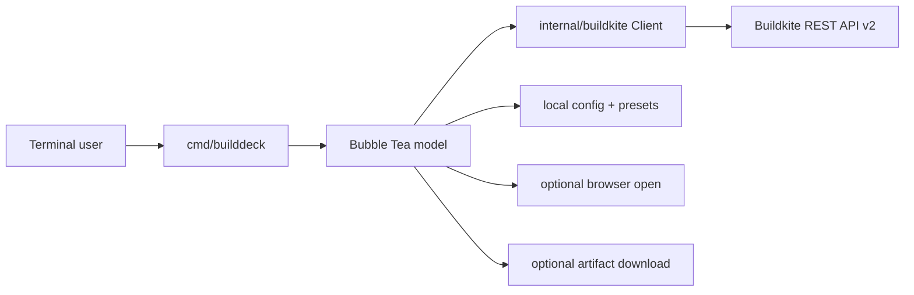

# Intent

## Product Outcome
`builddeck` is a production-quality Buildkite terminal flight deck: a live-updating Go TUI that gives platform engineers and release captains a dense, navigable control surface for organizations, pipelines, builds, jobs, queues, agents, logs, annotations, artifacts, and build health.

## Primary Users
- Platform engineers monitoring CI health across Buildkite organizations and pipelines.
- Release captains diagnosing failed, blocked, or running builds without leaving the terminal.
- Developers who need fast keyboard access to recent builds, job logs, artifacts, and safe Buildkite actions.

## Current Product Scope
## Scope
In scope:
- Authenticate with a Buildkite token from `BUILDKITE_API_TOKEN` or `~/.config/builddeck/config.toml`.
- List organizations, pipelines, recent builds, build detail, jobs, annotations, artifacts, and agents through Buildkite REST API v2.
- Navigate a three-pane terminal UI with keyboard bindings, loading states, error states, and compact fallbacks.
- Refresh manually with `R` and automatically with adaptive polling.
- Filter active panes with `/`, search globally with `ctrl+f`, and save/load filter presets.
- Tail selected/top job logs with `L`.
- Retry jobs, rebuild builds, cancel running builds, unblock blocked jobs, open Buildkite URLs, and download the first artifact.

Out of scope for the current contract:
- Hosted service, daemon, webhooks, server-side datastore, or multi-user coordination.
- Buildkite GraphQL dashboard snapshots.
- Per-artifact selection.
- Searching Buildkite resources that have not been loaded into the current TUI session.
- Rich annotation rendering; annotation HTML is flattened to terminal text.

## Product View

```mermaid
flowchart LR
  User[Terminal user] --> CLI[cmd/builddeck]
  CLI --> TUI[Bubble Tea model]
  TUI --> Client[internal/buildkite Client]
  Client --> BK[Buildkite REST API v2]
  TUI --> Config[local config + presets]
  TUI --> Browser[optional browser open]
  TUI --> Files[optional artifact download]
```

## Acceptance Criteria
- `builddeck` starts a Bubble Tea alternate-screen TUI when a token is available.
- Missing token exits before the TUI with a clear message and token-scope guidance.
- README, in-app help, and specs agree on keybindings and feature scope.
- Read-only Buildkite data loading covers organizations, pipelines, builds, build detail, jobs, annotations, artifacts, and agents.
- Mutating Buildkite actions are explicitly keyed, pane-aware, and constrained by current selection/state.
- Local config is stored under XDG config or `~/.config/builddeck/config.toml`; saved config does not write the token.
- Filtering never mutates Buildkite data; it only narrows already-loaded in-memory lists.
- Go proof passes: `gofmt`, `go test`, `go vet`, and `go build`.
- Decapod validation is run from a claimed isolated worktree; ambient Decapod state blockers are reported separately from code/spec proof.

## Constraints
- Runtime: local Go CLI, not a hosted service.
- API dependency: Buildkite REST API v2, bearer-token authentication, 30-second HTTP client timeout.
- Local state: config and user-selected downloaded artifacts only.
- Network dependency: live Buildkite requests fail visibly and do not crash the UI.
- Token handling: environment token takes priority over config; persisted config intentionally omits token on save.

## Active Assumptions
- Buildkite REST API v2 remains the authoritative external contract until GraphQL support is intentionally added.
- Current mutation actions are acceptable because they require explicit keypresses and operate only on visible, selected/top resources.
- Saved presets and downloaded artifacts are user-local preferences/artifacts, not shared project state.
- Adaptive polling is bounded by in-flight guards to avoid duplicate concurrent requests.

## Confidence & Risk Level
- Confidence: High. The contract is grounded in README and the current Go code.
- Risk: Medium. Buildkite API behavior and token scopes are external dependencies; failures must remain explicit and recoverable.

## Measured vs Inferred Facts
| Fact | Source | Type |
|---|---|---|
| CLI starts from `cmd/builddeck/main.go` | code | Measured |
| Token source is env var over config file | `cmd/builddeck/main.go`, `internal/config/config.go` | Measured |
| Buildkite client uses REST API v2 and bearer auth | `internal/buildkite/client.go` | Measured |
| UI is Bubble Tea / Lip Gloss | imports and README | Measured |
| Current roadmap excludes GraphQL and incident command mode | README | Measured |

## Stop Conditions
- A requested feature would require storing Buildkite tokens in committed files.
- A mutation would need hidden or ambiguous target selection.
- A spec update would claim support not present in code or README.
- Decapod emits a decision gate or blocks the workspace.

## Proof Required Before Completion
- Scaffold scan over `.decapod/generated/specs` has no generic template markers.
- `gofmt -l .` returns no files.
- `go test ./...` passes.
- `go vet ./...` passes.
- `go build -o /tmp/builddeck-proof ./cmd/builddeck` succeeds.
- `decapod validate --format json` is run and blockers are classified.

## Tradeoffs Register
| Decision | Benefit | Cost | Review Trigger |
|---|---|---|---|
| REST API first | Simple implementation and broad endpoint coverage | More requests for nested views | GraphQL snapshot work starts |
| Local config, no token save | Reduces secret persistence risk | Requires env var or manual config token input | Secure keychain support is added |
| Adaptive polling | Fresh running-build state with lower idle API pressure | More complex refresh state | Rate limit or stale-data issues appear |
| Pane-aware actions | Prevents broad hidden mutation scope | Requires clear selection semantics | New panes or action types are added |
