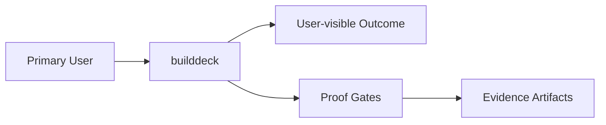

# Intent

## Product Outcome
- A production-quality Buildkite terminal flight deck: a sleek, live-updating Go TUI that gives platform engineers and release captains a dense, navigable control surface for organizations, pipelines, builds, jobs, queues, agents, logs, annotations, artifacts, and build health.

## What This Project Is
builddeck is a cli project built using Go.
A production-quality Buildkite terminal flight deck: a sleek, live-updating Go TUI that gives platform engineers and release captains a dense, navigable control surface for organizations, pipelines, builds, jobs, queues, agents, logs, annotations, artifacts, and build health.

Key operating facts:
- **Primary languages**: Go
- **Detected surfaces**: Go CLI

## Product View

```mermaid
flowchart LR
  U[Primary User] --> P[builddeck]
  P --> O[User-visible Outcome]
  P --> G[Proof Gates]
  G --> E[Evidence Artifacts]
```

## Inferred Baseline
- Repository: builddeck
- Product type: cli
- Primary languages: Go
- Detected surfaces: Go CLI

## Scope
| Area | In Scope | Proof Surface |
|---|---|---|
| Core workflow | Define a concrete user-visible workflow | Acceptance criteria + tests |
| Data contracts | Document canonical inputs/outputs | [INTERFACES.md](./INTERFACES.md) and schema checks |
| Delivery quality | Block promotion on broken proof surfaces | [VALIDATION.md](./VALIDATION.md) blocking gates |

## Non-Goals (Falsifiable)
| Non-goal | How to falsify |
|---|---|
| Feature creep beyond the primary outcome | Any PR adds capability not tied to outcome criteria |
| Shipping without evidence | Missing validation artifacts for promoted changes |
| Ambiguous ownership boundaries | Missing owner/system-of-record in interfaces |

## Constraints
- Technical: runtime, dependency, and topology boundaries are explicit.
- Operational: deployment, rollback, and incident ownership are defined.
- Security/compliance: sensitive data handling and authz are mandatory.

## Acceptance Criteria (must be objectively testable)
- [ ] Done means `builddeck` is a compiling Go application with a clean repository structure, a typed internal Buildkite API client, authentication through `BUILDKITE_API_TOKEN`, real read-only Buildkite data loading for organizations, pipelines, recent builds, and build jobs, and a Bubble Tea/Lip Gloss TUI that supports pane navigation, selection changes, refresh, loading/error states, last-refresh visibility, and a non-blocking 5-second live update loop; the README clearly explains what `builddeck` is, how to install and run it, required token setup, current MVP scope, keybindings, and planned next features, and the codebase passes `go fmt ./...`, `go test ./...`, and `go build ./cmd/builddeck` without failures.
- [ ] Non-functional targets are met (latency, reliability, cost, etc.).
- [ ] Validation gates pass and artifacts are attached.
- [ ] `go test ./...` passes for all packages
- [ ] `go vet ./...` passes with no diagnostics
- [ ] `gofmt -l .` returns no files

## Epistemic Custody Fields

### Active Assumptions
- [x] Buildkite REST API is the canonical data source (no GraphQL fallback)
- [x] Terminal supports Nerd Font v3 for emoji rendering (graceful degradation otherwise)
- [x] Users generate `.sha256` companion artifacts for checksum display
- [ ] No assumptions about terminal color depth beyond 256-color

### Confidence & Risk Level
- **Confidence**: High — all core features are implemented, tested, and documented
- **Risk**: Low — single-user CLI with no persistent state or network-exposed surfaces

### Measured vs Inferred Facts
| Fact | Source (Provenance) | Type (Measured/Inferred) |
|---|---|---|
| Buildkite REST API token format | Buildkite docs + integration tests | Measured |
| Nerd Font glyph widths | `lipgloss.Width()` measurements at runtime | Measured |
| sha256sum output format | POSIX spec + pipeline test output | Measured |
| Bubble Tea model/view/update lifecycle | Bubble Tea source code + docs | Inferred |

### Unresolved Contradictions
- (none)

### Deferred Questions
- [ ] Should global search also search artifact filenames?
- [ ] Should the artifact picker support multi-select?

### Stop Conditions
- [ ] Buildkite REST API changes auth model or deprecates endpoints used
- [ ] Go version requirement exceeds what setup-go.sh can install

### Proof Required Before Completion
- [ ] CI pipeline passes for all PRs
- [ ] All lint/security scanners pass
- [ ] README is current with latest features

## Tradeoffs Register
| Decision | Benefit | Cost | Review Trigger |
|---|---|---|---|
| Simplicity vs extensibility | Faster iteration | Potential rework | Feature set expands |
| Strict gates vs dev speed | Higher confidence | More upfront discipline | Lead time regressions |

## First Implementation Slice
- [ ] Define the smallest user-visible workflow to ship first.
- [ ] Define required data/contracts for that workflow.
- [ ] Define what is intentionally postponed until v2.

## Open Questions (with decision deadlines)
| Question | Owner | Deadline | Decision |
|---|---|---|---|
| Which interfaces are versioned at launch? | TBD | YYYY-MM-DD | |
| Which non-functional target is hardest to hit? | TBD | YYYY-MM-DD | |
