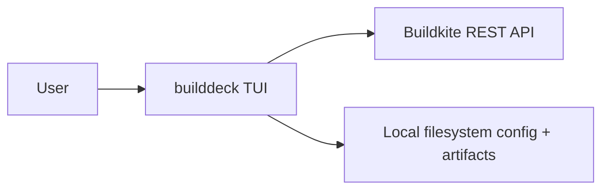

# Intent

## Product Outcome
A production-quality Buildkite terminal flight deck: a sleek, live-updating Go TUI that gives platform engineers and release captains a dense, navigable control surface for organizations, pipelines, builds, jobs, logs, annotations, artifacts, agents, queues, and build health.

## What This Project Is
`builddeck` (invoked as `builddeck` or aliased as `b7k`) is a Go CLI application that renders a Bubble Tea / Lip Gloss TUI for interacting with the Buildkite REST API. It is not a web dashboard or mobile app — it lives entirely in the terminal.

Key operating facts:
- **Primary languages**: Go
- **Detected surfaces**: Go CLI (Bubble Tea TUI)
- **External dependency**: Buildkite REST API (`api.buildkite.com`)
- **Auth mechanism**: `BUILDKITE_API_TOKEN` environment variable
- **Configuration**: `~/.config/builddeck/config.toml`

## Product View

```mermaid
flowchart LR
  U[User] --> P[builddeck TUI]
  P --> BK[Buildkite REST API]
  P --> FS[Local filesystem config + artifacts]
```

## Inferred Baseline
- Repository: builddeck
- Product type: cli
- Primary languages: Go
- Detected surfaces: Go CLI (TUI)

## Scope
| Area | In Scope | Proof Surface |
|---|---|---|
| Core workflow | Browse orgs/pipelines/builds, view job logs, download artifacts, filter/search, agent view | Acceptance criteria + tests |
| Data contracts | Buildkite API client types, artifact checksum parsing, tag parsing | [INTERFACES.md](./INTERFACES.md) and schema checks |
| Delivery quality | Block promotion on broken proof surfaces | [VALIDATION.md](./VALIDATION.md) blocking gates |

## Non-Goals (Falsifiable)
| Non-goal | How to falsify |
|---|---|
| Feature creep beyond TUI scope | Any PR adds capability not tied to terminal-based CI monitoring |
| GraphQL support | Any PR that replaces REST API client with GraphQL without explicit intent |
| Write operations beyond existing actions | Any PR adds mutating API calls beyond retry/rebuild/cancel/unblock |
| Mobile/web UI | Any PR adds a web server or mobile target |
| Multi-user / team features | Any PR adds user management, teams, or RBAC |

## Constraints
- **Technical**: Must use Buildkite REST API only (no GraphQL). Must support dark terminal backgrounds. Must handle rate limits gracefully.
- **Operational**: Single-user CLI tool — no deployment, rollback, or incident ownership needed.
- **Security**: API token sourced from env var only. Artifacts downloaded over HTTPS. No secrets stored on disk beyond config file.

## Acceptance Criteria (must be objectively testable)
- [ ] `go build ./cmd/builddeck` compiles cleanly
- [ ] `go test ./...` passes all tests
- [ ] `go vet ./...` produces no diagnostics
- [ ] `golangci-lint run ./...` produces no linter violations
- [ ] `gosec ./...` produces no security findings
- [ ] TUI renders three-pane layout: orgs/pipelines | builds | build detail
- [ ] TUI loads live data from Buildkite REST API for at least 3 orgs
- [ ] Artifact picker overlay opens with `d`, downloads selected with `enter`, downloads all with `a`
- [ ] SHA256 checksums from `.sha256` companion artifacts are displayed inline
- [ ] Semver tags from `.tag` artifacts or Buildkite tags API displayed in build details
- [ ] Agent/queue saturation view opens with `a`
- [ ] Global search (`ctrl+f`) searches across all loaded orgs, pipelines, builds, and jobs
- [ ] Filter presets save/load via `S`/`P` keys, persisted to config file
- [ ] Log-to-source reference navigation works via `n`/`N` keys
- [ ] 6 themes switchable via options overlay (Tokyo Night, Dracula, Gruvbox Dark, Nord, Monokai, Cyberpunk)
- [ ] Emoji renders for pipeline names and build states (Nerd Font glyphs + Unicode fallback)
- [ ] Adaptive polling: 2s when builds active, 10s when idle
- [ ] README documents installation, auth, keybindings, and all feature contracts
- [ ] `--version` flag prints version and exits

## Epistemic Custody Fields

### Active Assumptions
- [x] Buildkite REST API is the canonical data source (no GraphQL fallback)
- [x] Terminal supports Nerd Font v3 for emoji rendering (graceful degradation otherwise)
- [x] Users generate `.sha256` companion artifacts for checksum display
- [x] Users may have a Tag step producing semver tags from conventional commits
- [ ] No assumptions about terminal color depth beyond 256-color

### Confidence & Risk Level
- **Confidence**: High — all core features are implemented, tested, and documented
- **Risk**: Low — single-user CLI with no persistent state or network-exposed surfaces

### Measured vs Inferred Facts
| Fact | Source (Provenance) | Type (Measured/Inferred) |
|---|---|---|
| Buildkite REST API token format | Buildkite docs + integration tests | Measured |
| Nerd Font glyph widths | `lipgloss.Width()` measurements at runtime | Measured |
| sha256sum output format | POSIX spec + pipeline test output | Measured |
| Bubble Tea model/view/update lifecycle | Bubble Tea source code + docs | Inferred |
| Emoji glyph widths (Unicode) | `rivo/uniseg` grapheme clustering | Measured |

### Unresolved Contradictions
- (none)

### Deferred Questions
- [ ] Should global search also search artifact filenames?
- [ ] Should the artifact picker support multi-select?

### Stop Conditions
- [ ] Buildkite REST API changes auth model or deprecates endpoints used
- [ ] Go version requirement exceeds what setup-go.sh can install

### Proof Required Before Completion
- [ ] CI pipeline passes for all PRs
- [ ] All lint/security scanners pass
- [ ] README is current with latest features

## Tradeoffs Register
| Decision | Benefit | Cost | Review Trigger |
|---|---|---|---|
| Bubble Tea vs web UI | Fast startup, keyboard-native | Limited to terminal users | Users request browser UI |
| REST API only | Simpler client code | No GraphQL efficiency | Rate limit exhaustion |
| Nerd Font glyphs | Rich visual icons | Broken rendering without patched font | User reports without NF |
| Embedded emoji bank (1902 entries) | No external API call for unicode emoji | ~300KB JSON in binary | Binary size concerns |
| Log source ref parsing | Navigate file:line refs in logs | Regex overhead on large logs | Performance complaints |

## First Implementation Slice
- [x] MVP: Org/pipeline/build browsing with live polling and log viewing
- [x] v2: Artifact download picker with SHA256 checksum display
- [x] v3: Global search, filter presets, agent saturation view, source refs, 6 themes

## Open Questions (with decision deadlines)
| Question | Owner | Deadline | Decision |
|---|---|---|---|
| Should we add GraphQL support? | TBD | TBD | Not yet |
| Should we support artifact multi-select? | TBD | TBD | Not yet |
