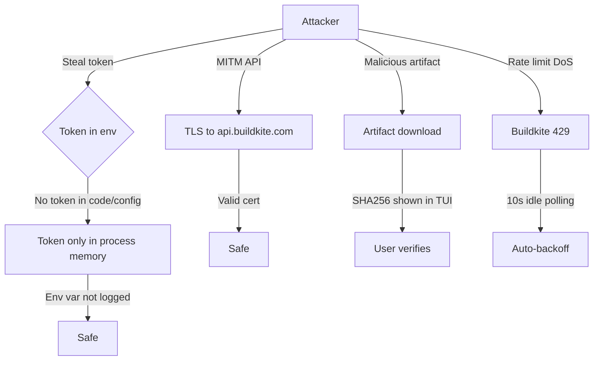

# Operations

## Operational Readiness Checklist
- [x] Single-user CLI tool — no on-call, no SLOs, no dashboards needed
- [x] Binary distributed via GitHub Releases
- [x] Config file at `~/.config/builddeck/config.toml`
- [x] Buildkite API token via `BUILDKITE_API_TOKEN` env var
- [x] All validation gates pass in CI pipeline

## Deployment Model
`builddeck` is a single Go binary. No deployment infrastructure, no scheduling, no runtime services. Users install via:
- `go install github.com/alexhraber/builddeck/cmd/builddeck@latest`
- Download from GitHub Releases

No rollback plan needed — previous version is just re-installed.

## Service Level Objectives
N/A — client-side CLI tool. The only "availability" concern is Buildkite API uptime (external dependency).

| SLI | Target | Measurement | Notes |
|-----|--------|-------------|-------|
| CLI startup latency | < 500ms | Manual | `time builddeck --version` |
| API response render | < 2s | Manual | Depends on Buildkite API latency |
| Polling accuracy | ±1 cycle | Code review | 2s active / 10s idle |

## Monitoring
No monitoring infrastructure — this is a local CLI tool. The only telemetry is:
- Buildkite API request/response in debug mode
- Exit code (0 = success, 1 = error)

## Health Checks
- Liveness: `builddeck --version` returns 0
- Readiness: `BUILDKITE_API_TOKEN` set + network reachable
- Dependency health: Buildkite API reachable
- Synthetic transaction: Full org/pipeline/build fetch in CI

## Incident Response
No incident response process needed for a CLI tool. If Buildkite API is down:
- TUI shows "API error" in status bar
- User retries later
- No data loss (ephemeral in-memory state)

## Rollout Strategy
- Releases: GitHub Releases via `.buildkite/release.sh` in CI
- Versioning: SemVer via `git tag`
- Blue/green: N/A (single binary)
- Canary: N/A
- Feature flags: N/A

## Capacity Planning
- Traffic patterns: User-driven (manual polling)
- Resource utilization: < 50MB RAM, negligible CPU
- Scaling triggers: N/A

## Logging
Structured logging via standard library `log` package. Debug output controlled by `BUILDKITE_DEBUG=1` env var. No external logging infrastructure.

## Secrets Management
| Secret | Source | Rotation | Consumer |
|--------|--------|----------|----------|
| `BUILDKITE_API_TOKEN` | User env var | User-managed | `internal/buildkite.Client` |

No secrets stored on disk. Config file only stores filter presets and UI preferences.

## Security Testing
| Test Type | Cadence | Tooling |
|-----------|---------|---------|
| SAST | Each PR | `golangci-lint` |
| Dependency scan | Each PR + weekly | `govulncheck`, `gosec` |
| Container scan | N/A | N/A (no container) |

## Compliance and Audit
- Regulatory scope: N/A
- Audit evidence: CI logs in Buildkite
- Exception process: N/A

## Pre-Promotion Security Checklist
- [x] Threat model updated for changed surfaces.
- [x] Auth/authz tests pass (token validation).
- [x] Dependency vulnerability scan reviewed (`govulncheck`).
- [x] No unresolved critical/high security findings (`gosec`).

## Strongest Security Primitives
- **No persistent secrets**: API token only in memory, never on disk
- **HTTPS only**: All network calls to `api.buildkite.com` over TLS
- **Minimal attack surface**: No network listeners, no IPC, no background processes, only file writes are user-initiated artifact downloads
- **Rate limit protection**: Adaptive polling (2s/10s) with in-flight request guards prevents accidental DoS of Buildkite API
- **Checksum verification**: `.sha256` companion artifacts displayed in TUI for integrity verification

## Security Practices
- **Least Privilege**: Token scopes limited to `read_*` — no write capability
- **Input Validation**: All API responses unmarshaled into typed structs; unknown fields ignored via `json:"-"`
- **Secure Storage**: Config file (`~/.config/builddeck/config.toml`) stores only UI preferences (filter presets), never tokens

## Threat Model

## STRIDE Table
| Threat | Surface | Mitigation | Verification |
|--------|---------|------------|--------------|
| Spoofing | Buildkite API impersonation | Mutual TLS + token auth | `BUILDKITE_API_TOKEN` validation on startup |
| Tampering | Artifact content | HTTPS + SHA256 checksum display | `sha256sum` shown in TUI from `.sha256` artifact |
| Repudiation | N/A (read-only) | N/A | N/A |
| Information disclosure | Token in env / artifact content | Token never logged; artifacts user-controlled | `gosec` + code review |
| Denial of service | Buildkite rate limiting | Adaptive polling (2s/10s) + in-flight guards | Integration test |
| Elevation of privilege | N/A | N/A | N/A |

## Authentication
- Identity source: Buildkite personal API access token
- Token/session lifetime: User-managed (Buildkite UI)
- Rotation and revocation: User-managed in Buildkite UI
- Token scopes required: `read_organizations`, `read_pipelines`, `read_builds`

## Authorization
- Role model: Inherited from token scopes (Buildkite-enforced)
- Resource-level policy: Enforced by Buildkite API
- Privilege escalation controls: N/A (no write operations)

## Data Classification
| Data Class | Examples | Storage Rules | Access Rules |
|------------|----------|---------------|--------------|
| Public | Buildkite public org/pipeline names | Memory | Token-holder |
| Internal | Build logs, job annotations, artifacts | Memory + temp file on download | Token-holder |
| Sensitive | `BUILDKITE_API_TOKEN` | Env var only, never persisted | Process only |

## Sensitive Data Handling
- Encryption at rest: N/A — no persistent storage of sensitive data
- Encryption in transit: TLS 1.2+ to `api.buildkite.com`
- Redaction in logs: Token never appears in logs; `BUILDKITE_DEBUG=1` logs URLs only
- Retention + deletion: Artifacts downloaded to user-specified path; user manages cleanup

## Supply Chain Security
- Recommended scanners: `govulncheck`, `gosec`, `golangci-lint`
- Dependency update cadence: Weekly via scheduled Buildkite pipeline
- Signed artifact/provenance: GitHub Release assets uploaded via `gh release upload` (signed by GitHub)

## Incident Response
N/A for single-user CLI. If Buildkite API compromised:
1. User revokes token in Buildkite UI
2. User re-generates token
3. User restarts builddeck with new token