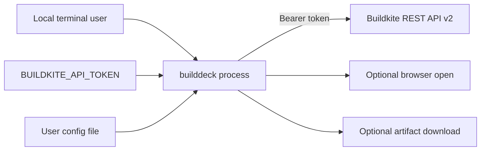

# Security

## Threat Model

## Trust Boundaries
- User terminal to process: trusted local operator input.
- Environment/config to process: sensitive token material and user preferences.
- Process to Buildkite: authenticated network boundary using bearer token.
- Process to browser/filesystem: local side effects initiated by explicit keypresses.
- Repository to Decapod: governed project state; do not commit user tokens, downloaded artifacts, or runtime-only files.

## STRIDE Table
| Threat | Surface | Mitigation | Verification |
|---|---|---|---|
| Spoofing | Buildkite API token | bearer auth, token supplied by user, documented scopes | client auth-header tests/review |
| Tampering | Buildkite mutation actions | explicit keybindings, pane-aware visible targets, running/blocked state checks | TUI action tests |
| Repudiation | Retry/rebuild/cancel/unblock actions | Buildkite owns audit trail; UI must show target context | manual review and Buildkite logs |
| Information disclosure | token/config/logs/artifacts | env token priority, saved config omits token, no bearer-token logging | config tests and diff review |
| Denial of service | polling and repeated actions | adaptive polling, in-flight guards, explicit action keys | TUI tests |
| Elevation of privilege | token scopes | user controls token; required scopes documented; no extra credential escalation | README/spec review |

## Authentication
- Primary token source: `BUILDKITE_API_TOKEN`.
- Secondary token source: config file, if present.
- Runtime priority: environment token overrides config token.
- Missing token: process exits before TUI launch with setup guidance.
- Rotation: rotate token in Buildkite, then update environment/config.

## Authorization
- Buildkite authorizes all reads and mutations according to the provided token.
- `builddeck` does not implement its own role model.
- Required read scopes are documented: `read_organizations`, `read_pipelines`, `read_builds`.
- Mutating actions require corresponding Buildkite token permissions; failures surface as Buildkite API errors.
- Actions are constrained by current visible resource state and selection.

## Data Classification
| Data Class | Examples | Storage Rules | Access Rules |
|---|---|---|---|
| Public | README, source, generated specs | committed repository | unrestricted |
| User-local preference | filter presets, download directory | user config file mode `0600` on save | local user |
| Sensitive | Buildkite API token | environment preferred; config readable if user chooses; saved config omits token | local user and process only |
| Buildkite CI data | builds, jobs, logs, annotations, artifacts, agents | in-memory during TUI session; optional downloaded artifacts | token-scoped Buildkite access |

## Sensitive Data Handling
- Do not commit `~/.config/builddeck/config.toml`, downloaded artifacts, or tokens.
- Do not print bearer tokens in errors, logs, or UI messages.
- Saved config writes filter/download settings but intentionally omits token material.
- Downloaded artifacts can contain secrets from CI; users choose the download directory and must handle files according to their organization policy.
- Buildkite logs and annotations may contain sensitive CI output; display them only in the local terminal session.

## Supply Chain Security
- Dependencies are Go modules recorded in `go.mod` and `go.sum`.
- Dependency updates require `go test ./...`, `go vet ./...`, and build proof.
- Use `govulncheck ./...` when available for release or dependency-update review.
- Release artifacts should be built from a clean git revision after validation.

## Security Testing
| Test Type | Cadence | Tooling |
|---|---|---|
| Auth/config behavior | each related PR | `go test ./internal/config ./internal/buildkite` |
| Action safety | each related PR | `go test ./internal/tui` |
| Static analysis | each PR | `go vet ./...` |
| Vulnerability scan | dependency update/release | `govulncheck ./...` when installed |
| Secret review | each PR | diff review for token-like strings and local artifacts |

## Strongest Security Primitives
- Token priority keeps normal usage in environment variables.
- Config save excludes token material.
- Buildkite client centralizes bearer-header construction and HTTP error handling.
- Action targeting rules bind mutations to visible resource context.
- Running/blocked checks reduce invalid cancel/unblock requests.
- Local-only architecture avoids hosted credential storage.

## Pre-Promotion Security Checklist
- [ ] No token or downloaded CI artifact is committed.
- [ ] README and specs describe required token scopes and token source behavior.
- [ ] Mutation action changes have tests for target selection and invalid states.
- [ ] Buildkite client changes preserve bearer auth and do not log token material.
- [ ] Dependency changes include Go proof and vulnerability review when practical.
