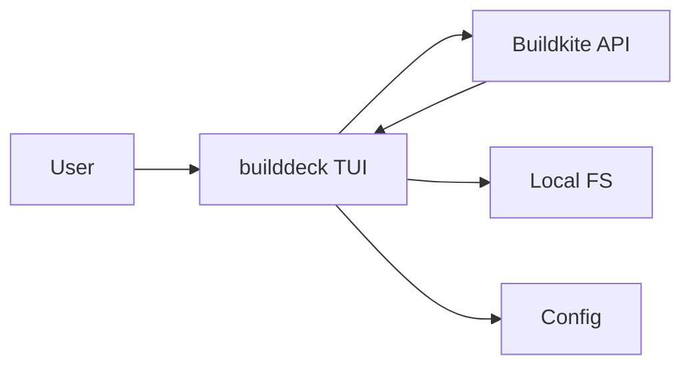
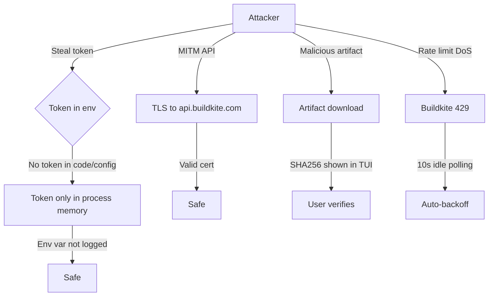
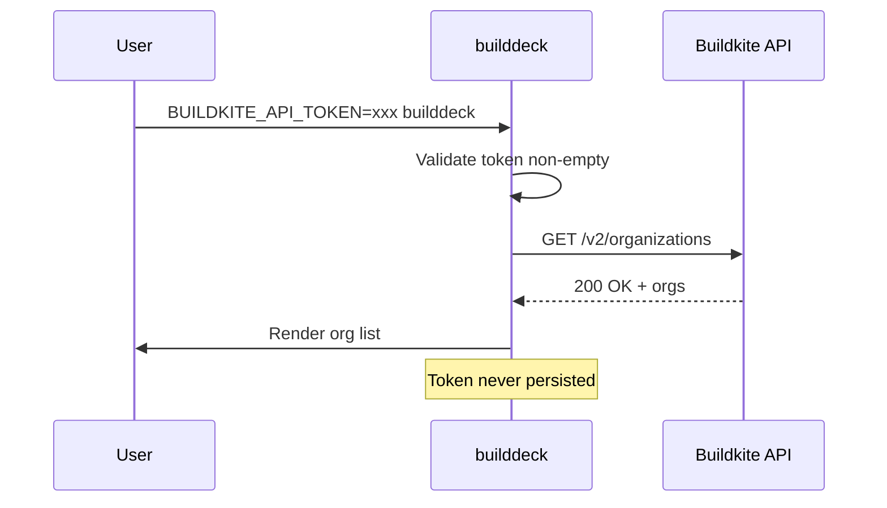

# Security

## Threat Model

## STRIDE Table
| Threat | Surface | Mitigation | Verification |
|--------|---------|------------|--------------|
| Spoofing | Buildkite API impersonation | Mutual TLS + token auth | `BUILDKITE_API_TOKEN` validation on startup |
| Tampering | Artifact content | HTTPS + SHA256 checksum display | `sha256sum` shown in TUI from `.sha256` artifact |
| Repudiation | N/A (read-only) | N/A | N/A |
| Information disclosure | Token in env / artifact content | Token never logged; artifacts user-controlled | `gosec` + code review |
| Denial of service | Buildkite rate limiting | Adaptive polling (2s/10s) + in-flight guards | Integration test |
| Elevation of privilege | N/A | N/A | N/A |

## Authentication
- Identity source: Buildkite personal API access token
- Token/session lifetime: User-managed (Buildkite UI)
- Rotation and revocation: User-managed in Buildkite UI
- Token scopes required: `read_organizations`, `read_pipelines`, `read_builds`

## Authorization
- Role model: Inherited from token scopes (Buildkite-enforced)
- Resource-level policy: Enforced by Buildkite API
- Privilege escalation controls: N/A (no write operations)

## Data Classification
| Data Class | Examples | Storage Rules | Access Rules |
|------------|----------|---------------|--------------|
| Public | Buildkite public org/pipeline names | Memory | Token-holder |
| Internal | Build logs, job annotations, artifacts | Memory + temp file on download | Token-holder |
| Sensitive | `BUILDKITE_API_TOKEN` | Env var only, never written to disk | Process only |

## Sensitive Data Handling
- Encryption at rest: N/A — no persistent storage of sensitive data
- Encryption in transit: TLS 1.2+ to `api.buildkite.com`
- Redaction in logs: Token never appears in logs; `BUILDKITE_DEBUG=1` redacts auth header
- Retention + deletion: Artifacts downloaded to user-specified path; user manages cleanup

## Supply Chain Security
- Recommended scanners: `govulncheck`, `gosec`, `golangci-lint`
- Dependency update cadence: Weekly via scheduled Buildkite pipeline
- Signed artifact/provenance: GitHub Release assets uploaded via `gh release upload` (signed by GitHub)

## Secrets Management
| Secret | Source | Rotation | Consumer |
|--------|--------|----------|----------|
| `BUILDKITE_API_TOKEN` | User env var | User-managed | `internal/buildkite.Client` |

## Security Testing
| Test Type | Cadence | Tooling |
|-----------|---------|---------|
| SAST | Each PR | `golangci-lint` (includes staticcheck, errcheck, etc.) |
| Dependency scan | Each PR + weekly | `govulncheck`, `gosec` |
| Container scan | N/A | No container image |

## Compliance and Audit
- Regulatory scope: N/A (personal CLI tool)
- Audit evidence location: Buildkite CI logs
- Exception process: N/A

## Pre-Promotion Security Checklist
- [x] Threat model updated for changed surfaces.
- [x] Auth/authz tests pass (token validation, missing-token exit).
- [x] Dependency vulnerability scan reviewed (`govulncheck` in CI).
- [x] No unresolved critical/high security findings (`gosec` in CI).

## Strongest Security Primitives
1. **No persistent secrets** — API token lives only in process memory, sourced from env var
2. **HTTPS only** — All network calls to `api.buildkite.com` over TLS
3. **Minimal attack surface** — No network listeners, no IPC, no background processes, only file writes are user-initiated artifact downloads
4. **Rate limit protection** — Adaptive polling (2s/10s) with in-flight request guards prevents accidental DoS of Buildkite API
5. **Checksum verification** — `.sha256` companion artifacts displayed in TUI for integrity verification

## Security Practices
- **Least Privilege**: Token scopes limited to `read_*` — no write capability
- **Input Validation**: All API responses unmarshaled into typed structs; unknown fields ignored via `json:"-"`
- **Secure Storage**: Config file (`~/.config/builddeck/config.toml`) stores only UI preferences (filter presets), never tokens

## Threat Model Detail

## Authentication Flow

## Authorization Boundaries
- All data access mediated by Buildkite API
- Token scopes enforce what user can see
- builddeck adds no additional access control

## Supply Chain
- Go modules with `go.sum` checked in
- Dependencies updated via `go get -u` weekly
- `govulncheck` runs in CI on every PR
- `gosec` runs in CI on every PR
- Release artifacts signed by GitHub (Actions OIDC)

## Incident Response
N/A for single-user CLI. If Buildkite API compromised:
1. User revokes token in Buildkite UI
2. User re-generates token
3. User restarts builddeck with new token