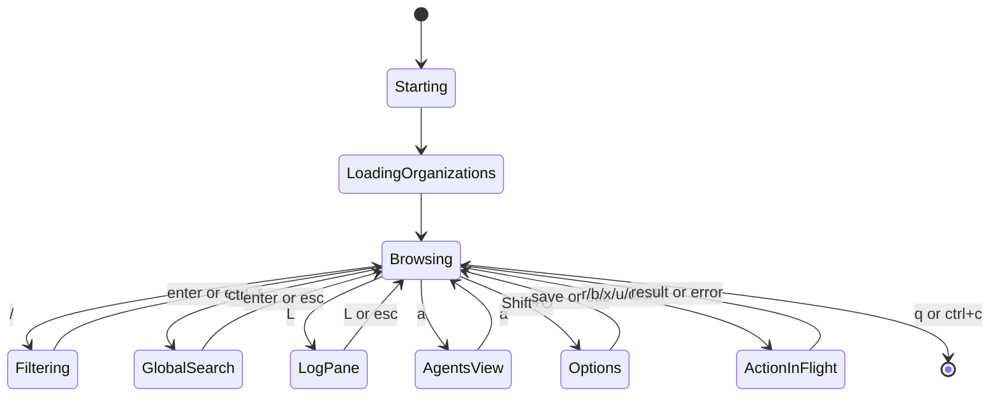

# Semantics

## State Machines

## Invariants
| Invariant | Type | Validation |
|---|---|---|
| Buildkite is the source of truth for CI data | Data | client contract and no local DB |
| Filters never mutate loaded Buildkite slices | UI/data | search/filter tests |
| Active pane determines selection movement | UI | model/update tests |
| Mutations require explicit keypress and visible target | Safety | action tests and README/spec target rules |
| `x` only cancels running builds | Safety | update logic/tests |
| `u` only unblocks blocked jobs | Safety | update logic/tests |
| Saved config does not persist token material | Security | config save behavior |
| Refresh has in-flight guards | Reliability | model state and update tests |

## Selection Semantics
- Left pane owns organization and pipeline selection.
- Center pane owns build selection.
- Detail pane owns job selection through the detail scroll/highlight state.
- Changing organization clears pipeline, build, detail, annotation, artifact, and job context.
- Changing pipeline clears build, detail, annotation, artifact, and job context.
- Changing build fetches detail, annotations, artifacts, and job state for that build.
- Refresh attempts to preserve selected resources by stable Buildkite identity/number when present.

## Action Targeting Rules
| Action | Left Pane | Builds Pane | Detail Pane |
|---|---|---|---|
| Logs `L` | latest build for selected pipeline, top job | highlighted build, top job | selected build, highlighted job |
| Retry `r` | latest build, top job | highlighted build, top job | highlighted job |
| Rebuild `b` | latest build | highlighted build | selected build |
| Cancel `x` | latest running build | highlighted running build | selected running build |
| Unblock `u` | latest build, blocked job if available | highlighted build, blocked job if available | highlighted blocked job |
| Open `o` | selected pipeline URL | highlighted build URL | selected build URL |
| Download `d` | latest build first artifact | highlighted build first artifact | selected build first artifact |

## Refresh Semantics
- Manual refresh with `R` clears all caches and reloads from Buildkite.
- Automatic polling uses a faster interval when loaded builds include non-terminal states.
- Idle polling uses a slower interval to reduce Buildkite API pressure.
- In-flight refreshes are not duplicated.
- Errors are visible and do not discard the last good loaded state unless the relevant selection changed.

## Filter and Search Semantics
- `/` filters the active pane only: pipelines, builds, or jobs.
- `ctrl+f` searches across currently loaded organizations, pipelines, builds, and jobs.
- Filters and searches are case-insensitive where implemented.
- Search results reference loaded objects only; no hidden Buildkite API query is implied.
- Clearing filter input restores the unfiltered loaded list.

## Log Semantics
- `L` opens a dedicated log pane for the selected/top job.
- `L` or `esc` closes the log pane.
- Opening logs may first fetch build detail if jobs are missing.
- Log scroll is independent of the main pane selection.

## Config and Preset Semantics
- Environment token overrides config token at runtime.
- Saved config omits token by design.
- Filter presets store name, query, and pane.
- Presets are user-local preferences, not project state.

## Error Semantics
| Error | Behavior |
|---|---|
| Missing token | exit with setup guidance before TUI launch |
| Buildkite HTTP failure | show operation-specific error and preserve UI responsiveness |
| Empty selection | no mutation; show status/error |
| Unsupported action state | no mutation; show status/error |
| Config parse failure | warn and continue with defaults |
| Download failure | show failure and keep TUI active |

## Idempotency Contracts
| Operation | Duplicate Behavior |
|---|---|
| GET data load | safe to retry; latest response updates visible state if still current |
| Manual refresh | guarded to avoid duplicate in-flight refreshes |
| Retry job | not idempotent; one explicit keypress per request |
| Rebuild build | not idempotent; one explicit keypress per request |
| Cancel build | constrained to running builds; repeat may no-op or fail at Buildkite |
| Unblock job | constrained to blocked jobs; repeat may no-op or fail at Buildkite |
| Save preset | writes current preset set to local config |
