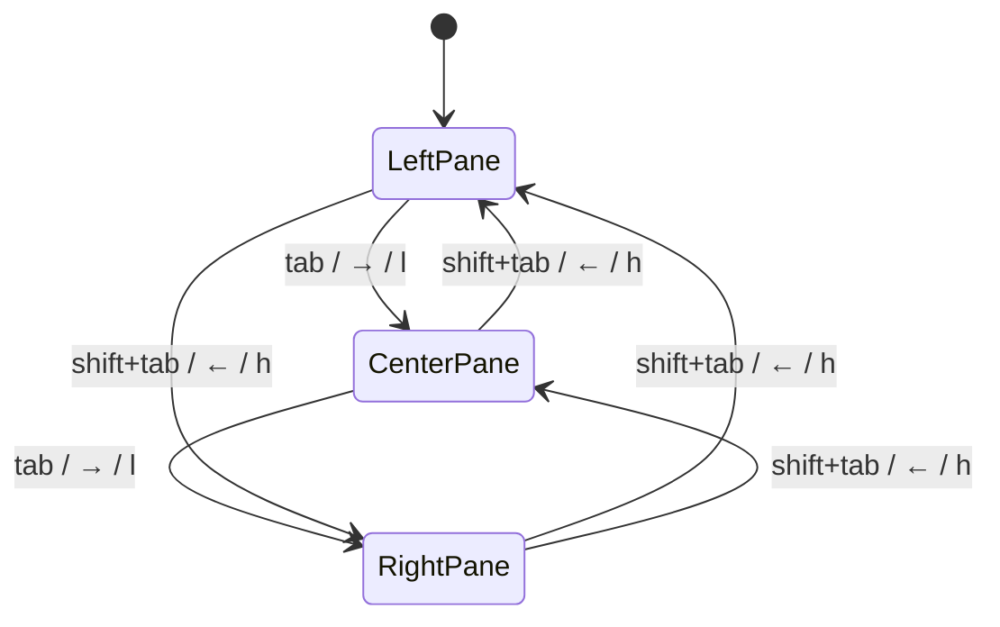
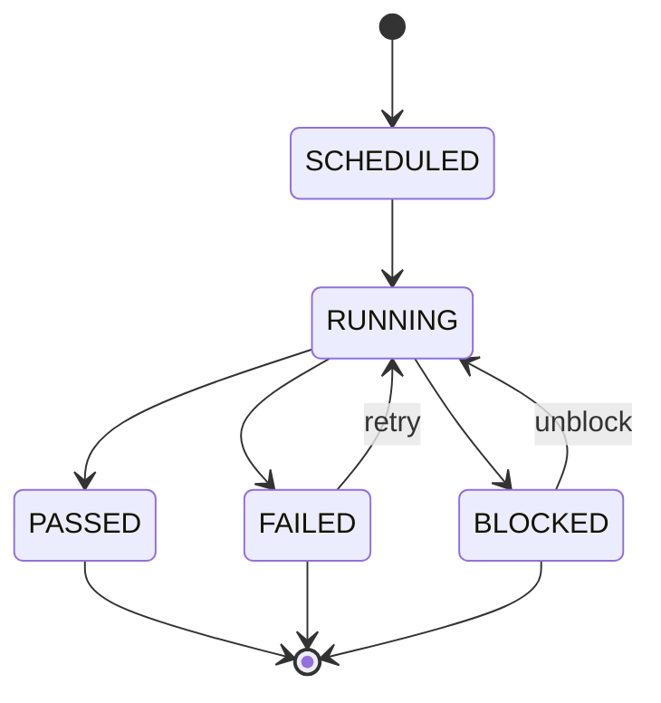
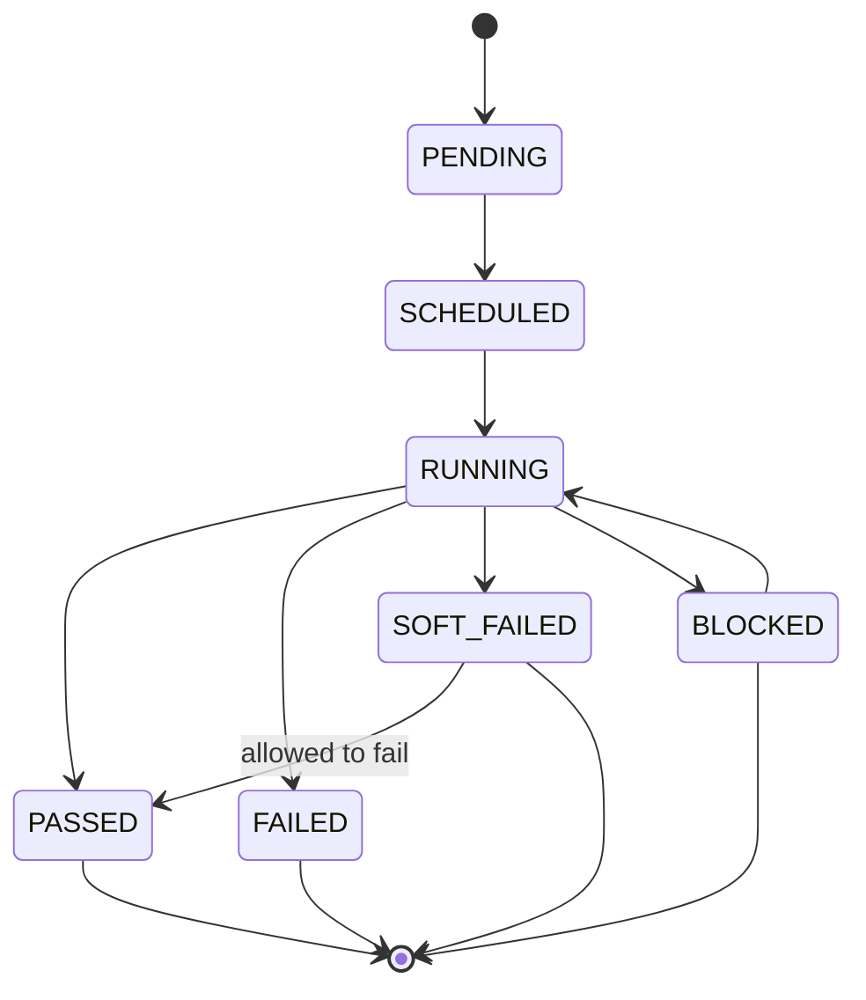
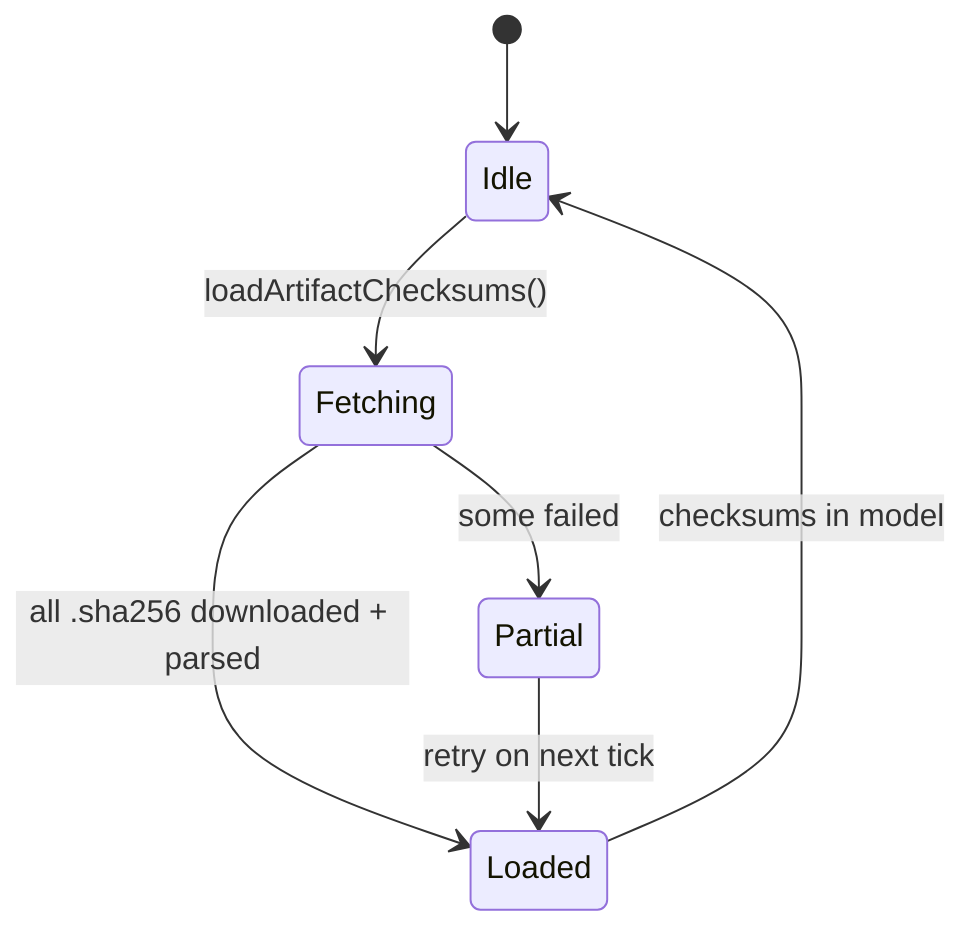

# Semantics

## State Machines

### TUI Pane Navigation

### Build State (from Buildkite)

### Job/Step State (from Buildkite)

### Artifact Checksum Loading

## Invariants
| Invariant | Type | Validation |
|-----------|------|------------|
| No API call without valid token | System | Startup exits with error if missing |
| In-flight request deduplication | System | `isFetching` guard in `fetch*Cmd` |
| Model nil-pointer safety | Data | All accessors return zero values safely |
| Artifact checksum matches pipeline | Data | Parsed from `.sha256` artifact content |
| Polling interval adaptive | System | 2s when any build running, 10s when idle |
| Selection preserved across refresh | Data | `rightScroll` tracked by build number |
| Emoji grapheme cluster integrity | Data | `uniseg.Graphemes()` for ZWJ sequences |
| Panel width never negative | System | `max(0, calculatedWidth)` in render |

## Event Sourcing Schema
N/A — no event sourcing. All state is in-memory Bubble Tea Model.

## Replay Semantics
N/A — no event log to replay. State rebuilds from API on each launch/refresh.

## Error Code Semantics
| Code | Namespace | Meaning | Retry Behavior |
|------|-----------|---------|----------------|
| `missing_token` | `builddeck` | `BUILDKITE_API_TOKEN` not set | No retry — fatal |
| `auth_failed` | `builddeck` | 401 from API | No retry — token invalid |
| `rate_limited` | `buildkite` | 429 from API | Auto-retry next poll cycle |
| `timeout` | `builddeck` | HTTP client timeout | Auto-retry next poll cycle |
| `download_failed` | `builddeck` | Artifact download error | Manual retry via `d` key |
| `parse_error` | `builddeck` | JSON unmarshal failure | Skip field, continue |

## Domain Rules
- **Polling cadence**: 2s when any selected build is non-terminal; 10s when all terminal
- **Artifact checksum**: Only displayed when `.sha256` companion artifact exists
- **Step selection**: Only `type == "script"` steps are selectable for logs
- **Pane focus**: Only one pane active at a time (visual border highlight)
- **Filter scope**: Filter applies only to active pane's loaded data
- **Download path**: User-specified directory; no temp file cleanup
- **Emoji rendering**: Nerd Font PUA glyphs preferred; Unicode fallback; grapheme-aware padding

## Idempotency Contracts
| Operation | Idempotency Key | Duplicate Behavior |
|-----------|-----------------|-------------------|
| `R` (refresh) | Build number + pipeline | Re-fetches, preserves selection |
| `d` (download) | Artifact ID + dest path | Overwrites existing file |
| `a` (download all) | All artifact IDs | Parallel downloads, each idempotent |
| `r` (retry job) | Job ID | Buildkite API idempotent |
| `b` (rebuild) | Build number | Buildkite API creates new build |
| `x` (cancel) | Build number | Buildkite API idempotent |
| `u` (unblock) | Job ID | Buildkite API idempotent |

## Language Note
- Primary language: Go 1.26+
- TUI framework: Bubble Tea (v0.25+) + Lip Gloss (v1.0+)
- HTTP client: stdlib `net/http`
- Testing: `testing` + `httptest` + `testify/assert` (if used)

## Invariant Validation Strategy
| Invariant | Test Location | Method |
|-----------|---------------|--------|
| Token required | `cmd/builddeck/main.go` | Exit code 1 + error message |
| No nil panics | `internal/tui/*_test.go` | Table tests with nil models |
| Polling interval | `internal/tui/update.go` | Assert interval in `tickCmd` |
| Checksum parsing | `internal/tui/update_test.go` | Mock `.sha256` response |
| Emoji width | `internal/tui/emoji_test.go` | `lipgloss.Width()` assertions |