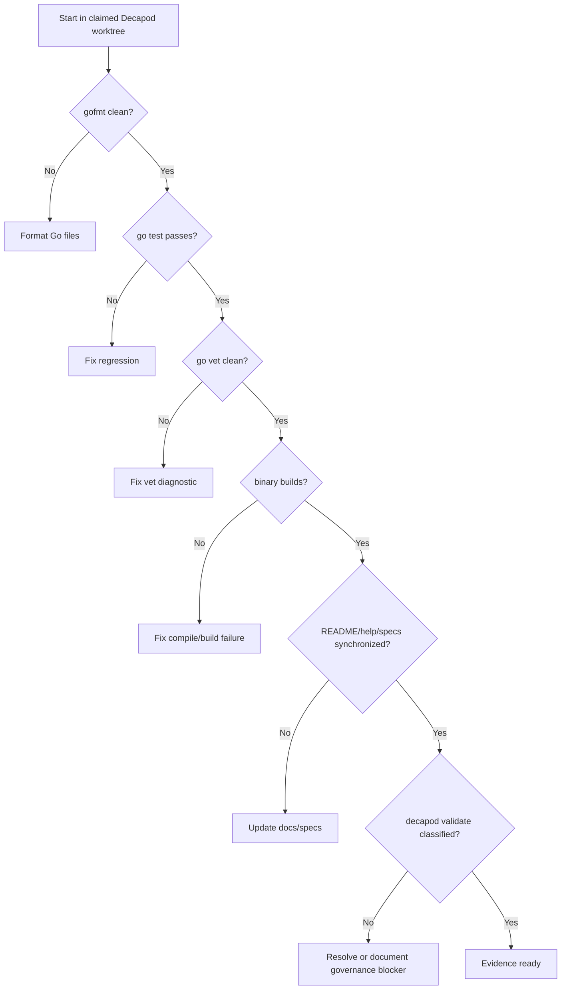

# Validation

## Validation Philosophy
Validation is a release gate, not documentation theater. A `builddeck` change is not complete until code, README/help text, generated specs, and proof commands agree with the actual behavior.

## Proof Commands
Use `/tmp` caches in sandboxed agent runs to avoid host cache permission and network surprises:

```bash
GOCACHE=/tmp/builddeck-gocache GOPATH=/tmp/builddeck-gopath GOMODCACHE=/tmp/builddeck-gopath/pkg/mod gofmt -l .
GOCACHE=/tmp/builddeck-gocache GOPATH=/tmp/builddeck-gopath GOMODCACHE=/tmp/builddeck-gopath/pkg/mod go test ./...
GOCACHE=/tmp/builddeck-gocache GOPATH=/tmp/builddeck-gopath GOMODCACHE=/tmp/builddeck-gopath/pkg/mod go vet ./...
GOCACHE=/tmp/builddeck-gocache GOPATH=/tmp/builddeck-gopath GOMODCACHE=/tmp/builddeck-gopath/pkg/mod go build -o /tmp/builddeck-proof ./cmd/builddeck
decapod validate --format json
```

## Generated Spec Gates
Generated specs are living project contracts. When README, keybindings, Buildkite client behavior, action targeting, config behavior, security posture, or proof commands change, update the canonical spec set:

- `.decapod/generated/specs/README.md`
- `.decapod/generated/specs/INTENT.md`
- `.decapod/generated/specs/ARCHITECTURE.md`
- `.decapod/generated/specs/INTERFACES.md`
- `.decapod/generated/specs/VALIDATION.md`
- `.decapod/generated/specs/SEMANTICS.md`
- `.decapod/generated/specs/OPERATIONS.md`
- `.decapod/generated/specs/SECURITY.md`

Current note: `decapod rpc --op specs.refresh` refreshes the manifest but also regenerates scaffold text in this checkout, so do not use it as proof that the spec bodies are product-specific until the generator is fixed upstream.

## Validation Decision Tree


## Promotion Gates
## Proof Surfaces
| Gate | Command / Check | Evidence |
|---|---|---|
| Format | `gofmt -l .` | no listed files |
| Unit and integration tests | `go test ./...` | zero failures |
| Static analysis | `go vet ./...` | zero diagnostics |
| Build | `go build -o /tmp/builddeck-proof ./cmd/builddeck` | binary created |
| Docs/spec sync | README, `internal/tui/keys.go`, `.decapod/generated/specs/*` | no contradictory keymap/scope claims |
| Governance | `decapod validate --format json` | pass or explicit ambient blocker classification |

## Focused Regression Surfaces
| Surface | Files | Required Coverage |
|---|---|---|
| Buildkite client | `internal/buildkite/client.go`, `client_test.go` | endpoint paths, auth header, pagination, error bodies, actions |
| Config | `internal/config/config.go`, `config_test.go` | env override, TOML parsing, save without token |
| TUI update/actions | `internal/tui/update.go`, `model_test.go` | key handling, pane targeting, logs, actions, search/options |
| Search/filter | `internal/tui/search.go`, `search_test.go` | stable filtered indexes, case-insensitive matching |
| Summary/time/formatting | `internal/tui/summary.go`, `timefmt.go`, tests | health counts, duration, HTML stripping |
| User docs | `README.md`, `internal/tui/views.go`, specs | current feature and keybinding claims |

## Known Ambient Governance Noise
Current Decapod validation may report pre-existing context capsule lineage mismatches unrelated to Builddeck code/spec edits. Do not hide these failures. Classify them separately from local Go proof and avoid direct mutation of Decapod databases or capsule artifacts.

## Evidence Artifacts
| Artifact | Path / Command | Required For |
|---|---|---|
| Go test log | `go test ./...` output | every behavior or docs contract change |
| Build proof | `/tmp/builddeck-proof` | compile proof |
| Spec manifest | `.decapod/generated/specs/.manifest.json` | generated spec updates |
| Decapod validation | `decapod validate --format json` output | governed completion |

## Regression Guardrails
- Keymap changes must update `internal/tui/keys.go`, in-app help, README, and generated specs together.
- Buildkite client endpoint changes require focused tests for method, path, auth, pagination, and error behavior.
- Config changes must preserve the no-token-on-save rule unless a separate security decision changes it.
- Action-targeting changes must prove left/build/detail pane semantics.

## Coverage Checklist
- [x] Buildkite REST client endpoint behavior covered by tests.
- [x] TUI navigation, logs, actions, global search, config, and summary behavior covered by focused tests.
- [x] README documents current install, auth, keymap, features, limitations, and development commands.
- [x] Generated specs describe the current product instead of generic scaffold text.
