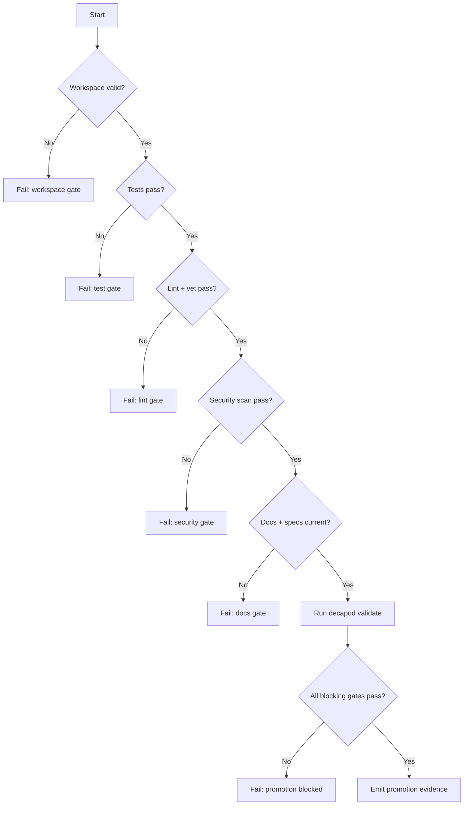
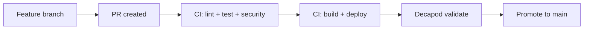

# Validation

## Validation Philosophy
> Validation is a release gate, not documentation theater.

## Validation Harness
All tests and verification run locally via the Go toolchain and CI via the Buildkite pipeline defined in `.buildkite/pipeline.yml`.

Key features:
- **Automated Tests**: Go unit tests in every `internal/` package
- **Linting & Formatting**: `golangci-lint`, `go vet`, `go fmt`
- **Security Scanning**: `gosec`, `govulncheck`
- **CI/CD Integration**: Buildkite pipeline runs all gates on every PR push
- **Code Coverage**: Reported to Codecov after test run

## Generated Spec Refresh Gates
Decapod must keep generated specs synchronized at governance pressure points. When repository surfaces change, validation should either fail with a concrete refresh instruction or, when explicitly requested through a refresh path, regenerate the existing spec files and update the manifest fingerprint. Refresh must update the canonical spec set rather than creating one-off analysis files.

Refresh-capable paths:
- `decapod validate --refresh-specs`
- `decapod rpc --op specs.refresh`
- initialization or scaffold refresh paths that regenerate `.decapod/generated/specs/*.md`

Refresh output requirements:
- Preserve hand-maintained epistemic custody fields where possible.
- Blend repo context into the existing canonical spec files.
- Update `.decapod/generated/specs/.manifest.json` after writing files.
- Avoid adding parallel project-state or architecture-survey documents outside the canonical spec set.

## Validation Decision Tree

## Promotion Flow

## Proof Surfaces
- `decapod validate` — methodology compliance
- Required test commands:
  - `go test ./...`
  - `go vet ./...`
  - `go run github.com/golangci/golangci-lint/cmd/golangci-lint@latest run ./...`
  - `go run github.com/securego/gosec/v2/cmd/gosec@latest ./...`
- Required build command:
  - `go build ./cmd/builddeck`

## Promotion Gates

### Blocking Gates
| Gate | Command | Evidence |
|---|---|---|
| Workspace protection | `decapod validate` | Gate output |
| Go tests pass | `go test ./...` | CI + local logs |
| Go vet passes | `go vet ./...` | CI + local logs |
| Linter passes | `golangci-lint run ./...` | CI + local logs |
| Security scan passes | `gosec ./...` | CI + local logs |
| Build succeeds | `go build ./cmd/builddeck` | CI + local logs |

### Warning Gates
| Gate | Trigger | Follow-up SLA |
|---|---|---|
| Code coverage regression | Coverage drops below current baseline | 48h |
| Non-blocking lint warning | `golangci-lint` warning output | 72h |
| Spec staleness | `decapod validate` spec drift | 24h |

## Evidence Artifacts
| Artifact | Path | Required For |
|---|---|---|
| Validation report | `.decapod/generated/artifacts/provenance/*` | Promotion |
| Test logs | CI artifact store | Promotion |
| Architecture diagram snapshot | `ARCHITECTURE.md` | Promotion |
| Coverage report | Codecov dashboard | Monitoring |

## Regression Guardrails
- Baseline references: `go test ./...` against main branch
- Statistical thresholds: N/A (deterministic test suite)
- Rollback criteria: Build fails or tests regress after merge

## Bounded Execution
| Operation | Timeout | Failure Mode |
|---|---|---|
| Validation | 30s | timeout or lock |
| Unit test suite | 120s | non-zero exit |
| Integration suite | 120s | non-zero exit |
| Security scan | 120s | non-zero exit |

## Coverage Checklist
- [x] Unit tests cover critical branches (API client, config, TUI)
- [x] Integration tests cover key user flows (API client HTTP mocks)
- [x] Failure-path tests cover retries/timeouts (error states in TUI)
- [x] Docs/diagram/changelog updates included in each PR