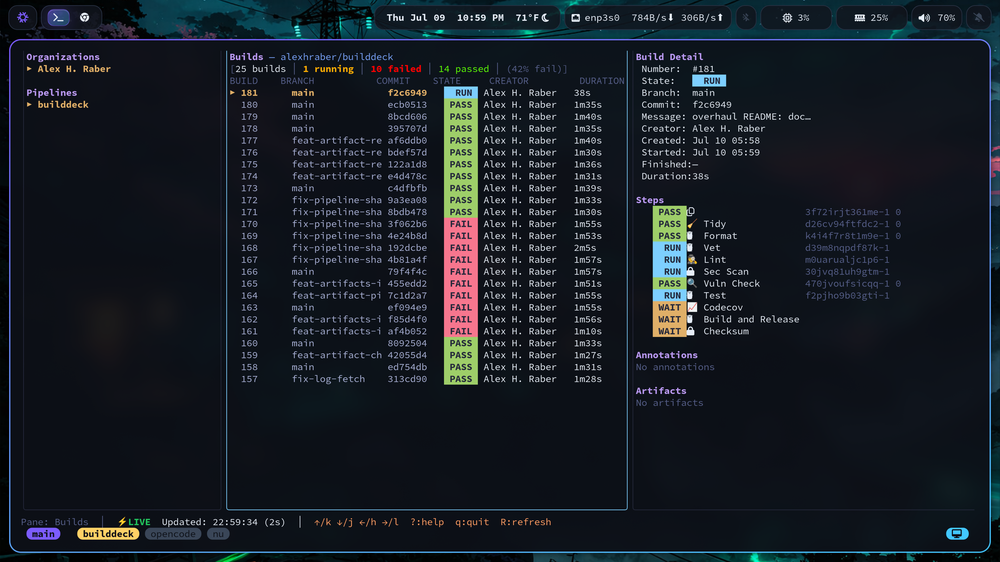
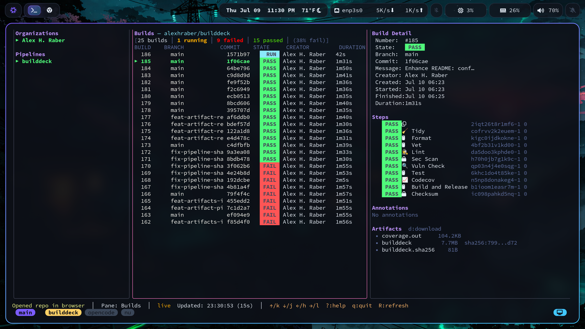

# builddeck

[](https://buildkite.com/alexhraber/builddeck)
[](https://go.dev/doc/devel/release#go1.26)

A Buildkite terminal flight deck — a sleek, live-updating Go TUI that gives platform engineers and release captains a dense, navigable control surface for organizations, pipelines, builds, jobs, annotations, artifacts, and build health.

Think `htop` for Buildkite. Or `k9s` for your CI.

`b7k` is used as a short moniker, but the product, repository, documentation, and command identity are consistently **`builddeck`**.

## Screenshots

builddeck TUI showing organizations, builds, and build detail panes:


builddeck TUI showing successful build in different theme:


## Why

Buildkite's web UI is powerful, but if you live in the terminal, context-switching to a browser to check build status is friction. `builddeck` brings real-time Buildkite visibility into your terminal with keyboard-driven navigation, live polling, and a dense pane-based layout.

## Install

```bash
go install github.com/alexhraber/builddeck/cmd/builddeck@latest
```

Or build from source:

```bash
git clone https://github.com/alexhraber/builddeck.git
cd builddeck
go build ./cmd/builddeck
```

## Run

```bash
export BUILDKITE_API_TOKEN="your-token-here"
builddeck
```

## Configuration

`builddeck` stores preferences in `~/.config/builddeck/config.toml`:

```toml
# Filter presets (saved via 'S', loaded via 'P')
[filter_presets]
"my-preset" = { pane = "builds", query = "main" }

# UI preferences
[ui]
# theme = "dark"  # future: theme selection
```

Environment variables:
- `BUILDKITE_API_TOKEN` — **required** (token from buildkite.com/user/api-access-tokens)
- `BUILDKITE_BASE_URL` — optional (for testing against mock API)
- `BUILDKITE_DEBUG=1` — logs HTTP requests to stderr

## Authentication

`builddeck` reads your Buildkite API token from the `BUILDKITE_API_TOKEN` environment variable.

Generate a token at: https://buildkite.com/user/api-access-tokens

Required scopes:
- `read_organizations`
- `read_pipelines`
- `read_builds`

If the token is missing, `builddeck` will exit immediately with a clear error message.

## Current Features

### Data Loaded
- **Organizations** — browse all orgs you have access to
- **Pipelines** — list pipelines per organization (with pagination)
- **Builds** — recent 25 builds per pipeline with build health summary
- **Build Detail** — full metadata: state, branch, commit, message, creator, timestamps, duration
- **Jobs** — all jobs for the selected build with state, label, agent, exit status
- **Logs** — tail the selected/top job log in a dedicated log pane (raw text fallback for large logs)
- **Annotations** — build annotations (info, warning, error, success styles)
- **Artifacts** — build artifacts with filename, size, and SHA256 checksum
- **Agents** — organization agent listing with queue saturation view (`a`)
- **Buildkite actions** — retry jobs, rebuild builds, cancel running builds, and unblock blocked jobs from the TUI
- **Open in browser** — `o` opens the current org/pipeline/build in the Buildkite web UI
- **Artifact picker** — `d` opens an interactive overlay to browse and download artifacts
- **Global search** — `ctrl+f` fuzzy search across all loaded organizations, pipelines, builds, and jobs
- **Config file** — token and preferences in `~/.config/builddeck/config.toml`
- **Saved filter presets** — `S` saves current filter, `P` loads a saved preset

### Artifact SHA256 Checksums

When a build contains a `.sha256` companion artifact (e.g. `builddeck.sha256` alongside `builddeck`), builddeck reads the real content hash and displays it inline next to the matching artifact. The checksum shown is the actual `sha256sum` output, not a hash of the download URL — so it matches what you'd get by verifying locally.

**Contract:** To see checksums in the TUI, add a step to your pipeline that generates a `.sha256` file and uploads it as an artifact:

```yaml
- label: ":lock: Checksum"
  command: |
    buildkite-agent artifact download builddeck /tmp/
    sha256sum /tmp/builddeck | tee builddeck.sha256
    buildkite-agent artifact upload builddeck.sha256
```

The `.sha256` file should contain the hash followed by a space and filename (standard `sha256sum` format). Only the hash portion (first whitespace-delimited field) is displayed.

### TUI
- **Three-pane layout** — orgs/pipelines | builds | detail+steps+annotations+artifacts
- **Header bar** — product name, breadcrumb (org/pipeline/build), refresh status
- **Build health summary** — count of running/failed/passed/blocked builds with failure rate
- **State badges** — compact, color-coded state labels (PASS/FAIL/RUN/BLCK/etc.)
- **Active pane highlighting** — clear border on the focused pane
- **Read-only filtering** — `/` filters the active pane across pipelines, builds, or build jobs
- **Live updates** — smart adaptive polling (2s when active builds are running, 10s when idle) with in-flight request guards
- **Graceful degradation** — compact fallback for small terminals
- **Loading/error states** — visible without crashing
- **Agent saturation view** — dedicated view showing queue depth and agent utilization per queue
- **Filter presets** — save and load reusable filter patterns from config

### Themes & Options

Press **`Shift+O`** to open the options overlay with:

| Option | Values | Default |
|--------|--------|---------|
| **Theme** | Tokyo Night, Dracula, Gruvbox Dark, Nord | Tokyo Night |
| **Refresh Rate** | Dynamic (2s/10s), 2s Live, 5s, 10s Idle, 30s, Disabled | Dynamic |
| **Layout Density** | Spacious, Dense | Spacious |
| **Build Sorting** | Newest First, Oldest First | Newest First |

Themes are full Lip Gloss color palettes — borders, titles, selection highlights, state colors (success/warning/failure/info/blocked), and dim text all adapt per theme.

### Navigation

| Key | Action |
|-----|--------|
| `↑` / `k` | Move up |
| `↓` / `j` | Move down |
| `←` / `h` | Previous pane |
| `→` / `l` | Next pane |
| `tab` | Next pane |
| `shift+tab` | Previous pane |
| `g` | Jump to top of active list |
| `G` | Jump to bottom of active list |
| `enter` | Select / drill down |
| `R` | Refresh all data |
| `L` | Tail selected/top job logs; press `L` or `esc` to return |
| `r` | Retry selected/top job |
| `b` | Rebuild selected/top build |
| `x` | Cancel selected/top running build |
| `u` | Unblock selected blocked job |
| `o` | Open current resource in browser |
| `Shift+O` | Open options overlay (theme, refresh, density, sort) |
| `d` | Open artifact download picker |
| `a` | Toggle agent/queue saturation view |
| `/` | Filter active pane |
| `ctrl+f` | Global search across all data |
| `S` | Save current filter as preset |
| `P` | Load a saved filter preset |
| `esc` / `enter` | Close filter input |
| `ctrl+u` | Clear filter input |
| `?` | Toggle help |
| `q` | Quit |

#### Artifact Picker Keys (when `d` overlay is open)

| Key | Action |
|-----|--------|
| `↑` / `k` | Navigate up |
| `↓` / `j` | Navigate down |
| `enter` | Download selected artifact |
| `a` | Download all artifacts in parallel |
| `esc` | Close overlay |

### Refresh Behavior
- **Smart Adaptive Polling**: Dynamically adjusts polling interval:
  - **2 seconds** when any build is in a non-terminal state (running, scheduled, etc.) to show live progress.
  - **10 seconds** when all builds are finished (idle state) to conserve Buildkite API rate limit budget.
- Status bar displays current refresh rate and a green `⚡LIVE` badge during active updates
- In-flight guards prevent duplicate concurrent requests
- Manual refresh (`R`) is always responsive and clears all caches
- Current selection preserved across refreshes when possible
- Falls back gracefully if selected items disappear

### Action Targeting
- On the org/pipeline pane, `L`, `r`, `b`, `x`, and `u` target the top/latest build for the selected pipeline
- On the builds pane, actions target the highlighted build
- On the detail pane, `r` and `u` target the highlighted job, while `b` and `x` target the selected build
- `x` only sends a cancel request for builds currently reported as running
- `u` only unblocks jobs with state `blocked`
- `o` opens the current context: pipeline on left pane, build on center pane, build on detail pane

### Data Flow
- Changing organization resets pipelines, builds, jobs, annotations, artifacts
- Changing pipeline resets builds, jobs, annotations, artifacts
- Changing selected build fetches detail (if jobs missing), annotations, and artifacts
- Filtering never mutates Buildkite data; it narrows already-loaded pipelines, builds, or jobs in the active pane
- Nil-pointer and index safety throughout

## Known Limitations

- **REST API only** — GraphQL support planned for more efficient nested queries
- **Limited pagination** — builds show first 25; pipelines and agents paginate up to 500
- **Annotations are HTML-stripped** — rich content is flattened to text
- **Global search** — searches only currently-loaded data, not all pipelines across orgs

## Troubleshooting

| Symptom | Fix |
|---|---|
| `BUILDKITE_API_TOKEN not set` | Export token: `export BUILDKITE_API_TOKEN=xxx` |
| "401 Unauthorized" | Token expired or wrong scopes — regenerate at buildkite.com/user/api-access-tokens |
| Emoji show as squares/boxes | Install a Nerd Font v3 (e.g. `JetBrainsMono Nerd Font`) |
| Artifact checksums missing | Pipeline needs a step that uploads `*.sha256` files |
| Builds show "No builds" | Pipeline may have no recent builds; check branch filter |
| Terminal too small | Minimum ~80x24; smaller shows compact fallback |

## Architecture (for Contributors)

`builddeck` is a single-binary Go CLI with a Bubble Tea TUI. No server, no database, no background processes.

**Stack:**
- **Go 1.26+** — standard library only for HTTP, JSON, filesystem
- **Bubble Tea** — TUI framework (Elm-like Model/View/Update)
- **Lip Gloss** — style/layout (replaced custom ANSI in v2)
- **Bubbles** — reusable TUI components (keybindings, viewport)

**Layout:**
```
internal/
  buildkite/   # REST client + types (orgs, pipelines, builds, jobs, artifacts, annotations, agents)
  config/      # TOML config (~/.config/builddeck/config.toml)
  tui/         # Bubble Tea model/view/update + emoji rendering
```

**Key behaviors:**
- **Adaptive polling**: 2s when any build is running, 10s when all terminal
- **In-flight guards**: Prevents duplicate concurrent API calls for same scope
- **Grapheme-cluster emoji**: Nerd Font PUA glyphs + Unicode fallback; ZWJ sequences preserved
- **Artifact checksums**: Fetches `.sha256` companion artifacts, parses first field of `sha256sum` output
- **Token handling**: Reads `BUILDKITE_API_TOKEN` from env only; never persisted to disk
- **Log fetching**: `?content=true` with raw text fallback + `Accept: text/plain`; script steps only
- **Step types handled**: `script` (logs), `waiter` (hidden), `trigger`/`deploy` (metadata only)

## Dynamic Build Details (Tertiary Validation)

builddeck enriches build details and artifacts with data from dedicated pipeline steps — not from Buildkite itself. These are **tertiary validations**: Buildkite doesn't validate them; our dedicated steps do.

### Git Tag from Tag Step

The **Tag step** (`:bookmark: Tag`) in the pipeline:
1. Runs after all validation passes
2. Analyzes conventional commits since last tag
3. Creates/pushes semver tag (e.g., `v0.1.1`)
3. builddeck queries Buildkite API for tags on the build's commit SHA
4. Displays the tag in build details under the commit hash

This is **not** Buildkite-managed — it's our step creating the tag, our TUI discovering it.

### Artifact Checksum from Checksum Step

The **Checksum step** (`:lock: Checksum`) in the pipeline:
1. Downloads the binary artifact
2. Runs `sha256sum` → produces `builddeck.sha256`
3. Uploads `.sha256` as companion artifact
4. builddeck detects `.sha256` artifacts, fetches them, parses the hash
5. Displays checksum inline next to matching artifact

This is **tertiary validation** — Buildkite doesn't compute or verify checksums; our dedicated step and TUI do.

### Contract for Pipeline Authors

To enable these features, add these steps to your pipeline:

```yaml
steps:
  # ... your validation steps ...

  - label: ":bookmark: Tag"
    key: tag
    depends_on:
      - test
      - lint
      # ... all validation steps ...
    command: |
      # Auto-tag based on conventional commits
      VERSION=$(determine_version_from_commits)
      git tag -a "$VERSION" -m "Release $VERSION"
      git push origin "$VERSION"

  - label: ":golang: Build and Release"
    key: build
    depends_on: tag
    command: |
      # Build binary
      # Query GitHub for tag on this commit SHA
      VERSION=$(gh api repos/:owner/:repo/git/refs/tags --jq '.[] | select(.object.sha == "'$BUILDKITE_COMMIT'") | .ref' | sed 's|refs/tags/||')
      go build -ldflags="-X main.version=$VERSION" ...

  - label: ":lock: Checksum"
    key: checksum
    depends_on: build
    command: |
      buildkite-agent artifact download builddeck /tmp/
      sha256sum /tmp/builddeck | tee builddeck.sha256
      buildkite-agent artifact upload builddeck.sha256
```

The **Tag** step runs after all validation (fan-in), creates the tag.
The **Checksum** step runs after build, creates `.sha256` companion artifact.

builddeck automatically:
- Queries tags for each build's commit SHA → shows in build details
- Detects `.sha256` companion artifacts → shows checksum on artifacts

## Planned Next Features

- **GraphQL dashboard snapshots** — efficient nested queries for dashboard views
- **Incident command mode** — focused view for diagnosing and resolving build failures

## Security

- **Read-only by default** — only `retry`/`rebuild`/`cancel`/`unblock` mutate state, each requires explicit keypress
- **Token in env only** — `BUILDKITE_API_TOKEN` never written to disk, never logged
- **HTTPS everywhere** — all API and artifact downloads over TLS
- **No secrets in binaries** — supply chain scanned via `govulncheck` + `gosec` on every PR

## Development

```bash
go build ./cmd/builddeck     # build
go fmt ./...                  # format
go test ./...                 # test
go vet ./...                  # vet
```

## License

MIT
# trigger
feat: add tag display in build details
fix: fix typo in release notes
feat: add tag display in build details
feat: add tag artifact for build details display
fix: fix tag step exit on no conventional commits
fix: ensure tag creation works
feat: release v0.2.0 with proper tag/release pipeline
